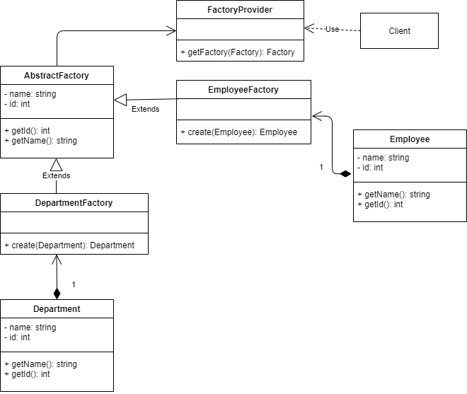
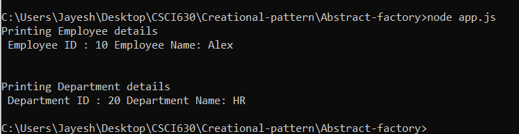

# Abstract Factory pattern

## Definition
  Abstract Factory pattern provides an interface for creating families of related or dependent objects without specifying their concrete classes.

## Implementation
1) The example provides details on the Employee and Department in a company using Nodejs.
2) Department and Employee class has ID and Name as the attributes.
3) To create new Employee and Department two classes are initialized EmployeeFactory and DepartmentFactory.
4) We are making use of concrete classes EmployeeFactory and DepartmentFactory which return the common object of Company. Since Abstract class does not exists in javascript we make use of the above classes replicating Company interface.
5) A common FactoryProvider class is used based on the client inputs and respective factory classes are initialized.
6) The result provides the department ID and name along with the Employee Id and name without digging in their concrete classes.

## Links
[app.js](./app.js)
[Department.js](./Department.js)
[DepartmentFactory.js](./DepartmentFactory.js)
[Employee.js](./Employee.js)
[EmployeeFactory.js](./EmployeeFactory.js)
[FactoryProvider.js](./FactoryProvider.js)

## UML Diagram:

## Output:

## Advantages
1) The client is independent of how we create and compose the objects in the system
2) The system consists of multiple families of objects which are designed to be used together.
3) We need a run-time value to construct a particular dependency
