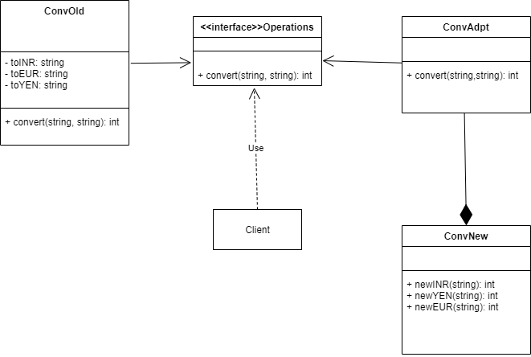
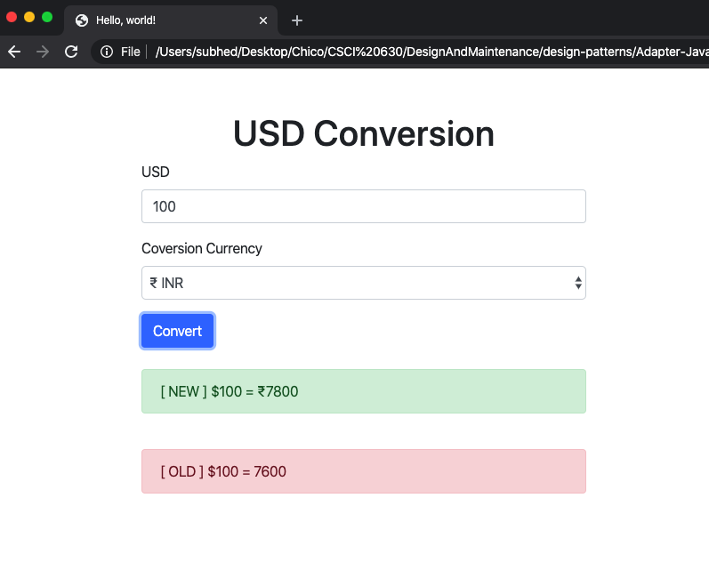
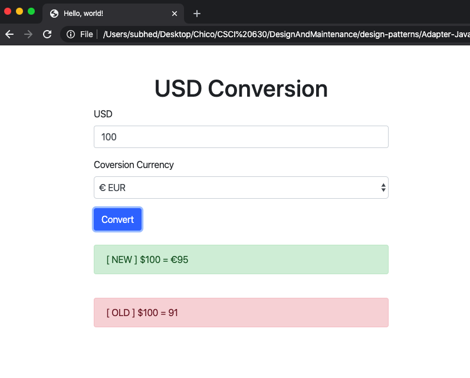
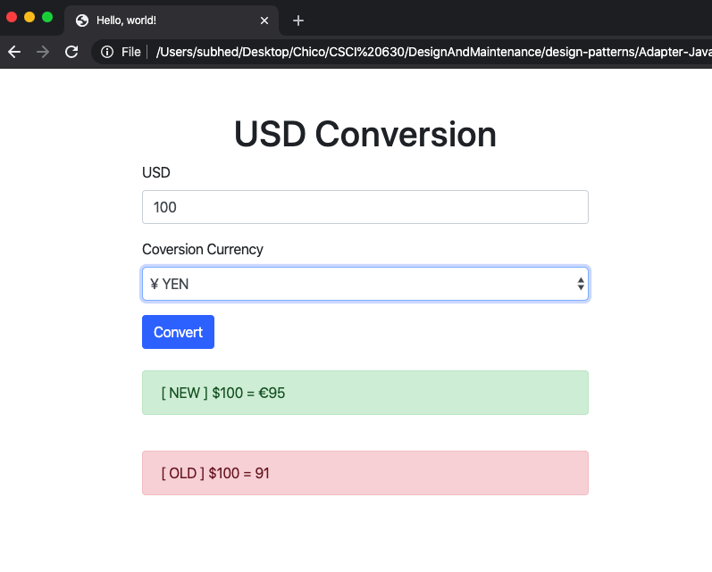

# Adapter Pattern

An Adapter pattern acts as a connector between two incompatible interfaces that otherwise cannot be connected directly. An Adapter wraps an existing class with a new interface so that it becomes compatible with the client’s interface. Adapters are used when new functionality needs to be integrated into the existing functionality in the application. 

## JavaScript Example

### Currency Converter

Here is a UML illustration of `Operations` implemented as an `Adapter Design Pattern`.

In this example, we have developed `Currency Converter` application, which converts `USD` to `INR,` `EUR,` `YEN.` This example consists of Operations Interface, which takes input from the clients, which includes the amount and the currency type to be converted. Then it gives it to the adapter, which is `ConvAdpt,` and then forwarded to the new component, which is `ConvNew` in the program to perform the desired conversion. In this example, we get two outputs one is shown from the old component `ConvOld,` and another is from the new component `ConvNew.` The new component consists of new features like prepend currency symbol to the converted amount and latest exchange rates.

### Running the example

This example consists of a front-end written in pure HTML/CSS and contains a form to get input from the client and then hands over to the JS Class to perform the required operation.

In this output we have converted USD to INR  

In this output we have converted USD to EUR  

In this output we have converted USD to YEN  

