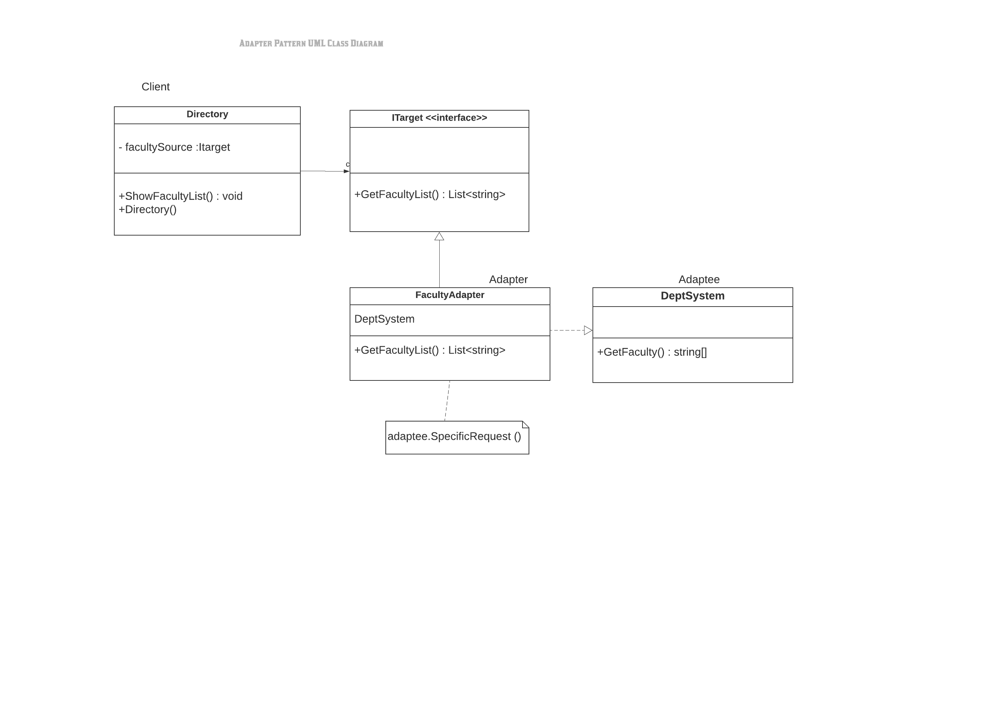

#Adapter Pattern

In software engineering, the adapter pattern is a software design pattern (also known as wrapper, an alternative naming shared with the decorator pattern) that allows the interface of an existing class to be used as another interface.
It is often used to make existing classes work with others without modifying their source code. It is one of the Gang of Four design patterns.

Definition
An adapter allows two incompatible interfaces to work together. This is the real-world definition for an adapter. Interfaces may be incompatible, but the inner functionality should suit the need. The adapter design pattern allows otherwise incompatible classes to work together by converting the interface of one class into an interface expected by the clients.

An example is an adapter that converts the interface of a Document Object Model of an XML document into a tree structure that can be displayed.

The classes and objects participating in this pattern are:

1) ITarget
This is an interface which is used by the client to achieve its functionality/request.

2) Adapter
This is a class which implements the ITarget interface and inherits the Adaptee class. It is responsible for communication between Client and Adaptee.

3) Adaptee
This is a class which has the functionality, required by the client. However, its interface is not compatible with the client.

4) Client
This is a class which interacts with a type that implements the ITarget interface. However, the

