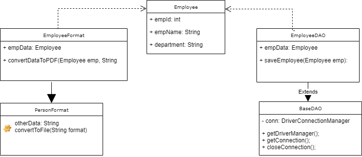

## Single Responsibility Principle

# Group members
Jayesh Sathe
Subhed Chavan

# Definition : 
A class should have a single responsibility, where a responsibility adds a reason to change.
we should take care that one class at the most is responsible for doing one task or functionality among the whole set of responsibilities that it has.
And only when there is a change needed in that specific task or functionality should this class be changed.

# Example :

Intial Employee Class:

class Employee {
int empId;
String name;
String department;

storeEmployee();
deleteEmployee();
convertDataToPDF();

}

# Modified Employee Class:

public class Employee {
int empId;
String name;
String department;

}

public class EmployeeDAO extends BaseDAO {
	storeEmployee(Employee emp);
	deleteEmployee(Employee emp);
}
public abstract class BaseDAO {
	getDriverManager();
	getConnection();
	closeConnection();
	
}
public class EmployeeFormat extends PersonFormat {
	convertDataToPDF();
}
public abstract PersonFormat {
	convertDataToFile();
}

# UML Diagram

# Motivation :
1) Maintainability : Any enterprise application and maintaining is oneof the factors.
and demanding need for enhancing the application.
2) Testability: Test Driven Development are required inlarge application
3) Flexibility and Extensibility : Changing the business requirement during and post production.The deign should be able to cope
up to these factors
4) Parallel Development- As its not possible for entire toeam to work on same module in application
5) Loose Coupling: Makes application easier and safer to make in any changes in one area of system as system becomes independent.

SOLID principles play an important role in making use of above points to build a application.

# Advantages:
1) Improved Usability
2) Easy to understand and maintain.
