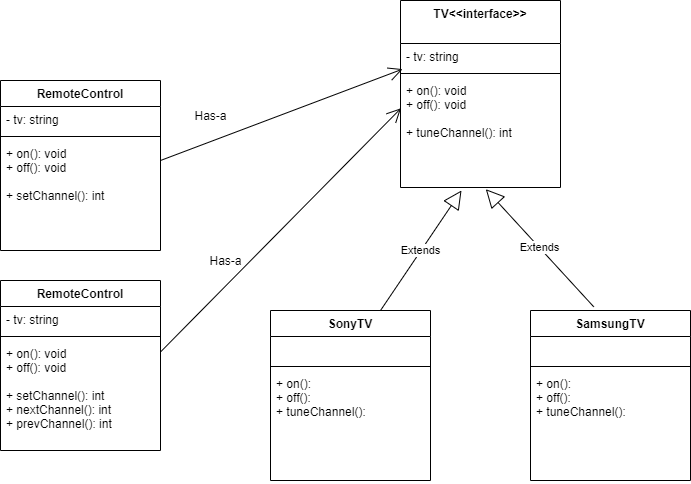
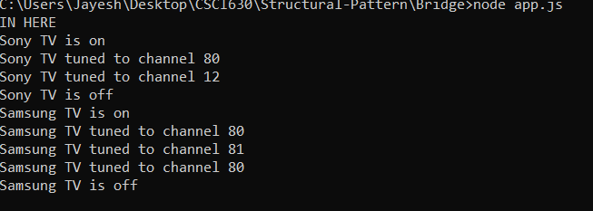

# Bridge pattern

## Definition
  The Bridge pattern allows two components, a client and a service, to work together with each component having its own interface. Bridge is a high-level architectural pattern and its main goal is to write better code through two levels of abstraction

## Implementation
1) The example displays RemoteControl and PowerControl classes which provides abstract features for a TV.
2) Two types of TV like SonyTV and SamsungTV are taken which use the functionality like on, off, setting channel through above classes.
3) Interface TV cannot be displayed in Javascript though represented in UML.
4) The result is triggered by calling RemoteControl and PowerControl classes to activate TV classes.
5) The improvement in remotes used for operation is dealt by Bridge pattern which is shown in output.

## Links
[RemoteControl.js](./RemoteControl.js)
[PowerRemote.js](./PowerRemote.js)
[SonyTV.js](./SonyTV.js)
[SamsungTV.js](./SamsungTV.js)
[app.js](./app.js)

## UML Diagram:

## Output:

## Advantages
1) Builder pattern  helps to achieve loose coupling.

