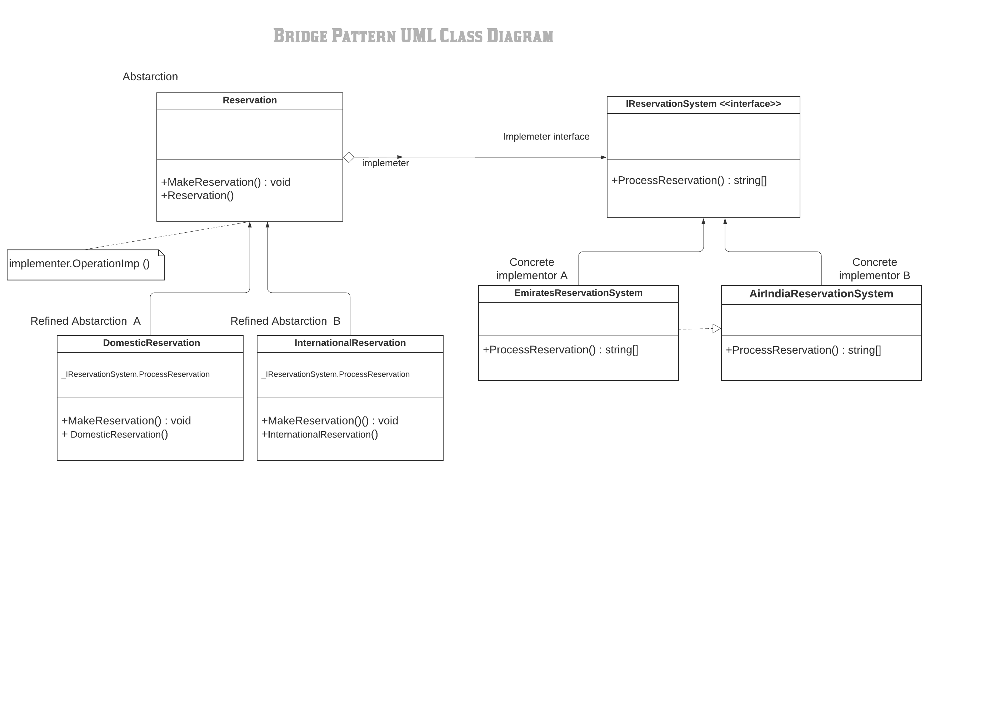

#Bridge Pattern

The bridge pattern is a design pattern used in software engineering that is meant to "decouple an abstraction from its implementation so that the two can vary independently", introduced by the Gang of Four. The bridge uses encapsulation, aggregation, and can use inheritance to separate responsibilities into different classes.

Definition
Decouple an abstraction from its implementation so that the two can vary independently.

The classes and objects participating in this pattern are:

1) Abstraction   
   - Defines the abstraction's interface.
   - Maintains a reference to an object of type Implementor.

2) RefinedAbstraction    
   - Extends the interface defined by Abstraction.

3) Implementor   
   - Defines the interface for implementation classes. This interface doesn't have to correspond exactly to Abstraction's    interface; in fact the two interfaces can be quite different. Typically the Implementation interface provides only primitive operations, and Abstraction defines higher-level operations based on these primitives.

4) ConcreteImplementor   (CustomersDataObject)
   - Implements the Implementor interface and defines its concrete implementation.

