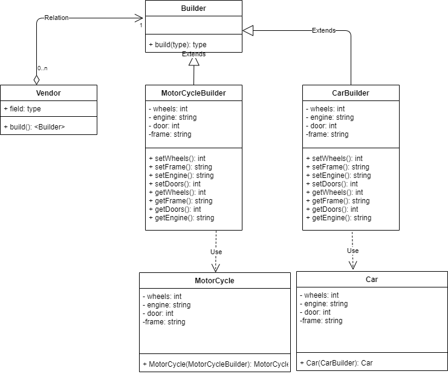
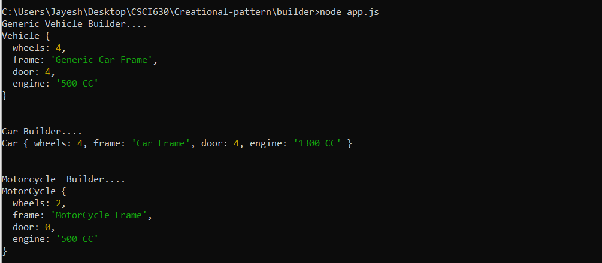

# Builder pattern

## Definition
  Builder pattern aims to separate the construction of a complex object from its representation so that the same construction process can create different representations.

## Implementation
1) The example provides details on the VehicleBuilder, CarBuilder, MotorCycleBuilder classes which produce Car, MotorCycle and other vehicle products  using Nodejs.
2) The bean classes used are  Car , Motorcycle which are immutable classes with attributes like  name, frame, engine, doors  without any setter methods.
3) AbstractBuilder class is not defined in the javascript and hence public classes like VehicleBuilder, CarBuilder, MotorCycleBuilder classes are introduced which have setter methods to set the values for engine, door, frame etc.
4) The above builder classes also contains build() method to build the object externally.
5) The Vendor class  makes use of the builder objects to build the vehicle.
6) The resultant output are the cars manufactured using Vendor with specific Builder controls.

## Links
[app.js](./app.js)
[Car.js](./Car.js)
[CarBuilder.js](./CarBuilder.js)
[MotorCycle.js](./MotorCycle.js)
[MotorCycleBuilder.js](./MotorCycleBuilder.js)
[Vehicle.js](./Vehicle.js)
[VehicleBuilder.js](./VehicleBuilder.js)
[Vendor.js](./Vendor.js)

## UML Diagram:

## Output:

## Advantages
1) Builder pattern  helps minimize the number of parameters in constructor.
2) Helps to create immutable objects without complex logic.
