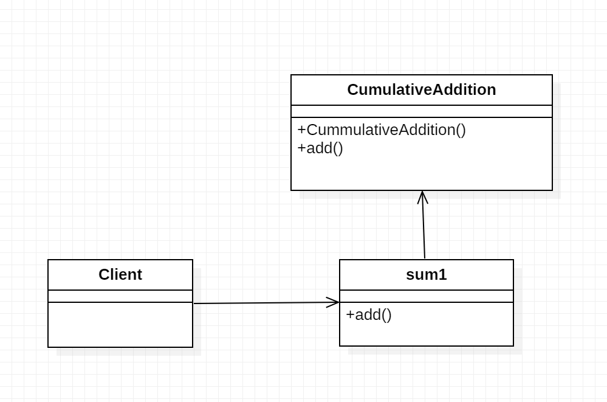

# Chain of Respoinsibility Pattern

1. The Chain of Responsibility pattern provides a chain of loosely coupled objects one of which can satisfy a request. This pattern is essentially a linear search for an object that can handle a particular request.

2. It is like event-bubbling in which an event propagates through a series of nested controls one of which may choose to handle the event. The Chain of Responsiblity patterns is related to the Chaining Pattern which is frequently used in JavaScript.

3. In this example, we create a class CumulativeAddition, which can be instantiated with an optional initialsum. It has a method add that adds the passed value to the sum attribute of the object and returns the object itself to allow chaining of add method calls.


##### JavaScript example




###### Output
```
12
35
108
```