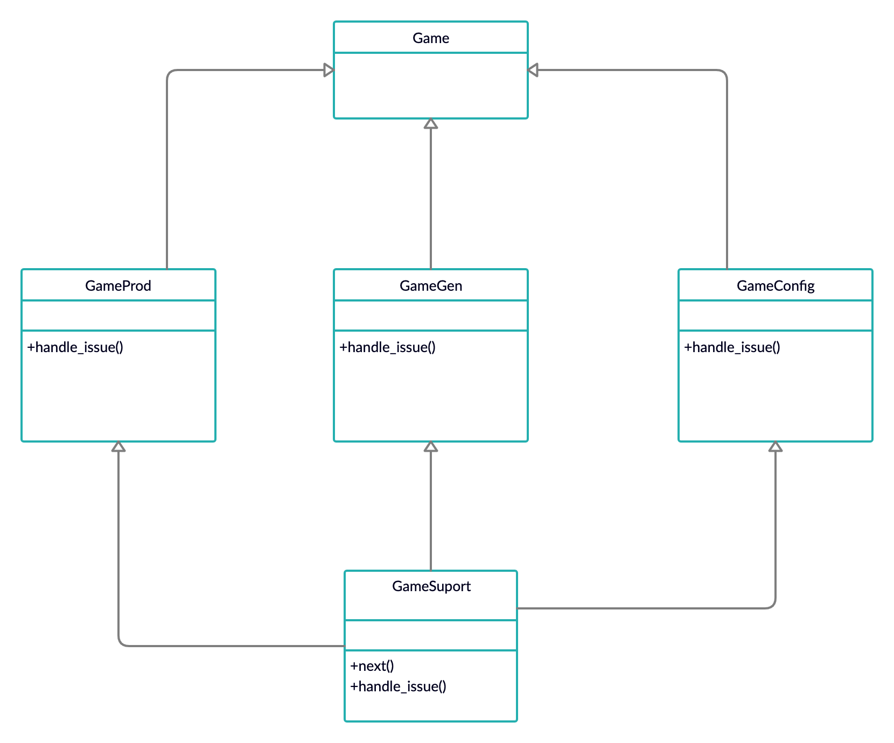

# Chain of Responsibility

In object-oriented design, the chain-of-responsibility pattern is a design pattern consisting of a source of command objects and a series of processing objects. Each processing object contains logic that defines the types of command objects that it can handle; the rest are passed to the next processing object in the chain. A mechanism also exists for adding new processing objects to the end of this chain. Thus, the chain of responsibility is an object oriented version of the if ... else if ... else if ....... else ... endif idiom, with the benefit that the condition–action blocks can be dynamically rearranged and reconfigured at runtime.


## Running the example

To execute the program from command line, please use the following command:
```{bash}
~ ruby game.rb 

Banned for 10 years!! Stop using Gaame_Cheats
```