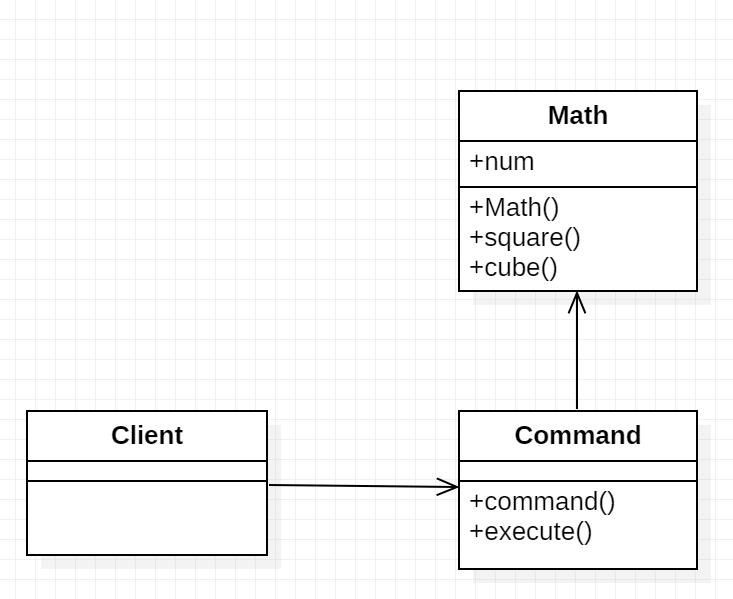

# Command Pattern

1. The Command pattern encapsulates actions as objects. Command objects allow for loosely coupled systems by separating the objects that issue a request from the objects that actually process the request. These requests are called events and the code that processes the requests are called event handlers.

2. It aims to encapsulate method invocation, requests, or operations into a single object and gives us the ability to both parameterize and pass method calls around that can be executed at our discretion. In addition, it enables us to decouple objects invoking the action from the objects that implement them, giving us a greater degree of overall flexibility in swapping out concrete classes (objects).

###### UML

3. In this example, we have a class called Math that has multiple methods and a Command class that encapsulates commands that are to be executed on its subject, i.e. an object of the Math class. The Command class also keeps track of all the commands executed, which can be used to extend its functionality to include undo and redo type operations.

# output

['square', 'cube']

