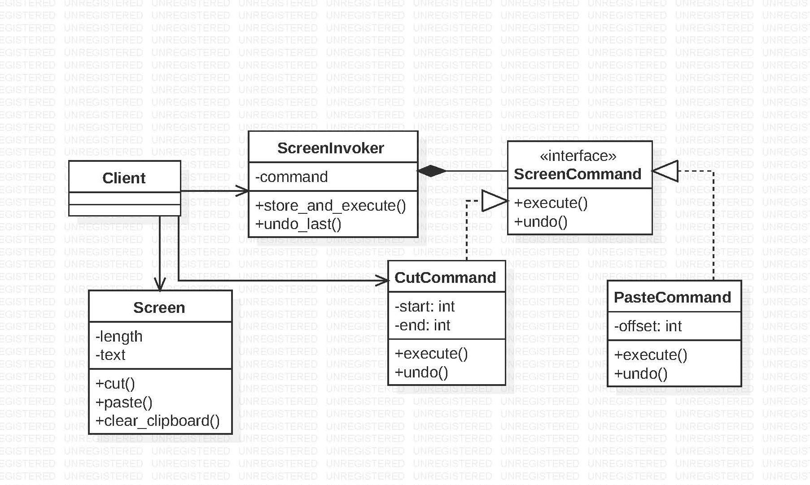

# Command Method

The main goal of this design pattern is to decouple the object that invokes the operation from the other object  that knows how to perform it.
This can be done by encapsulating the command from the client as an object.This transformation lets you parameterize methods with different requests, delay or queue a request’s execution The command object knows about a receiver object that manages its internal state when the command is executed. Finally the invoker objects are used to execute the commands.

 
# Command Method Example :-
In the given example the command pattern is used to track the history of various operations performed on a digital clipboard by the client.Here receiver object is a screen which have the attributes screen and clipboard. Various operations like cut,paste,clear_cliboard and length of the text can be performed on the clipboard. The screen(receiver) manages the internal state of the object which seperates from the ScreenInvoker object which invokes various commands from the client. In this way the invoker object is decoupled from the receiver object which performs the underlying functionality. The screen comand interface is used to parameterize methods to execute,delay or undo a command.

# Command Design Pattern Output:

Original Text:  Design Patterns!
After Cut    :  Design !
After Paste  :  PatternsDesign !
Undo Once    :  Design !
Undo Twice   :  Design Patterns!