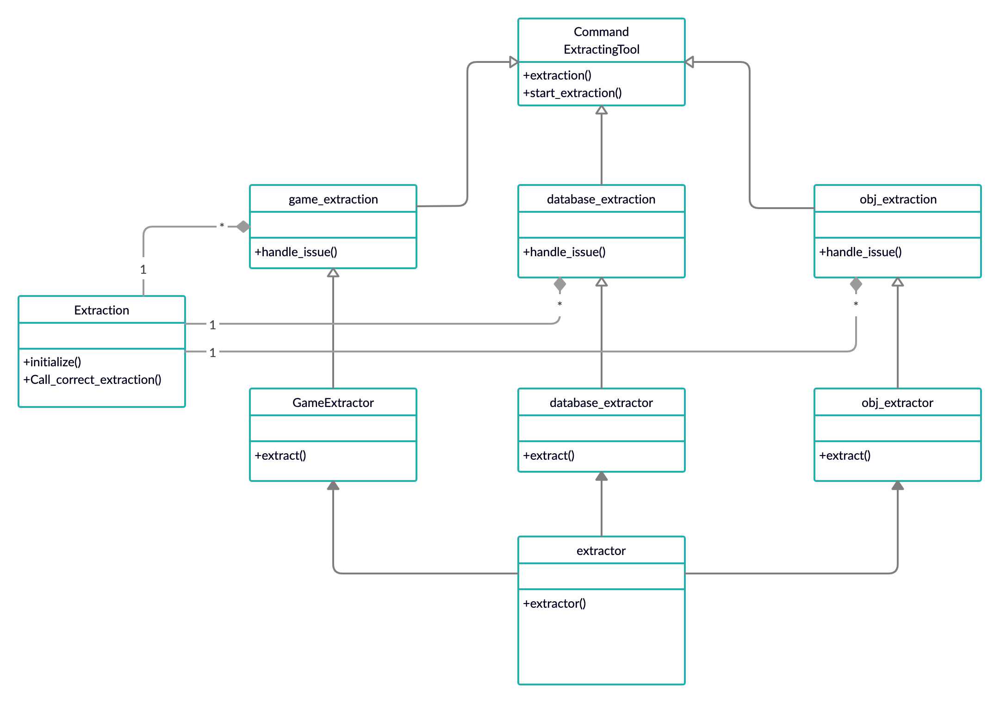

# Command

In object-oriented programming, the command pattern is a behavioral design pattern in which an object is used to encapsulate all information needed to perform an action or trigger an event at a later time. This information includes the method name, the object that owns the method and values for the method parameters.

Four terms always associated with the command pattern are command, receiver, invoker and client. A command object knows about receiver and invokes a method of the receiver. Values for parameters of the receiver method are stored in the command. The receiver object to execute these methods is also stored in the command object by aggregation. The receiver then does the work when the execute() method in command is called. An invoker object knows how to execute a command, and optionally does bookkeeping about the command execution. The invoker does not know anything about a concrete command, it knows only about the command interface. Invoker object(s), command objects and receiver objects are held by a client object, the client decides which receiver objects it assigns to the command objects, and which commands it assigns to the invoker. The client decides which commands to execute at which points. To execute a command, it passes the command object to the invoker object.


## Running the Example

To execute the program from command line, please use the following command:

```{bash}
% ruby command_design_pattern.rb 
Extracting game...
Extracting OBJ file...
Loading database for the game...
```
