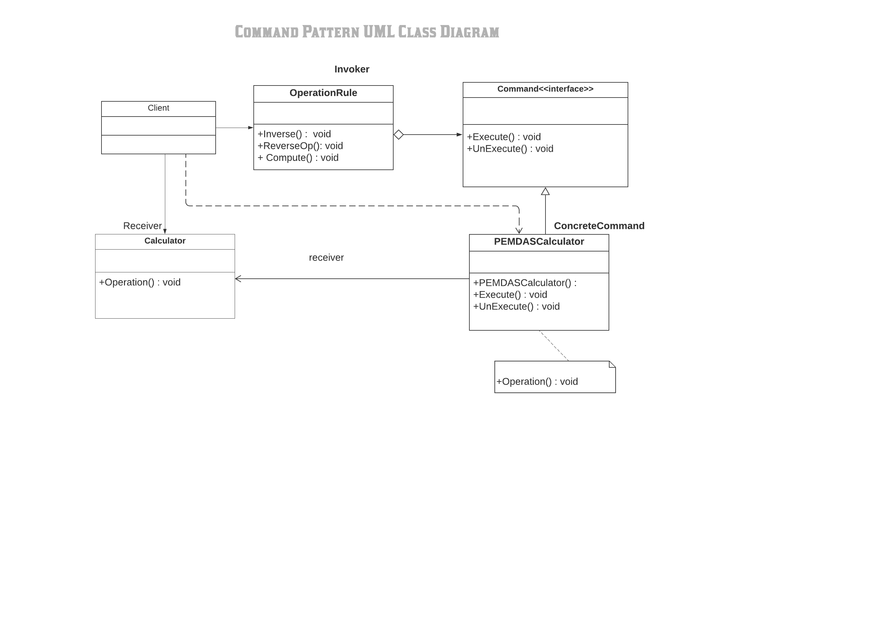

#Command Pattern

The command pattern is a behavioural design pattern in which an object is used to encapsulate all information needed to perform an action or trigger an event at a later time. This information includes the method name, the object that owns the method and values for the method parameters.

Definition

- Encapsulate a request as an object, thereby letting you parameterise clients with different requests, queue or log requests, and support undoable operations.

Using the Command design pattern can solve these problems:

- Coupling the invoker of a request to a particular request should be avoided. That is, hard-wired requests should be avoided.
- It should be possible to configure an object (that invokes a request) with a request.  

Using the Command design pattern describes the following solution:

- Define separate (command) objects that encapsulate a request.
- A class delegates a request to a command object instead of implementing a particular request directly.
- This enables one to configure a class with a command object that is used to perform a request.
- The class is no longer coupled to a particular request and has no knowledge (is independent) of how the request is carried out.

The classes and objects participating in this pattern are:

1) Client
-  This is the class that creates and executes the command object.

2) Invoker
-  Asks the command to carry out the action.

3) Command
-  This is an interface which specifies the Execute operation.

4) ConcreteCommand
-  Defines a binding between a Receiver object and an action
-  This is a class that implements the Execute operation by invoking operation(s) on the Receiver.

5) Receiver
-  This is a class that performs the Action associated with the request.

