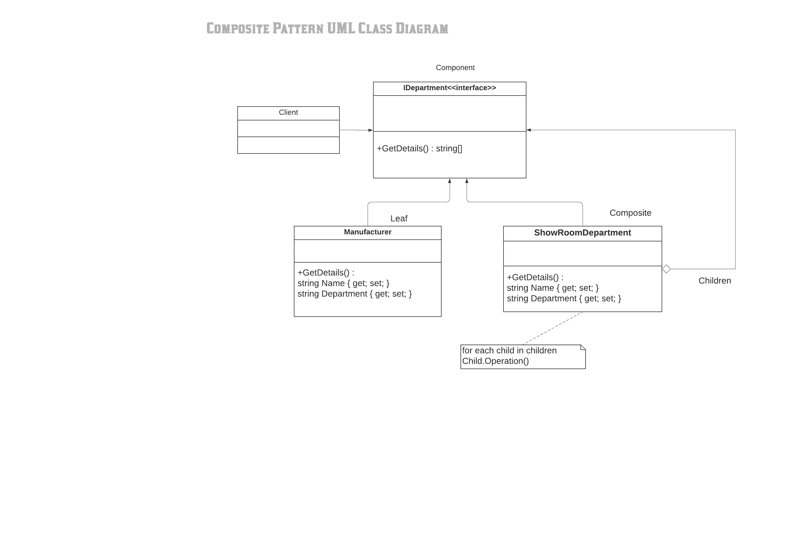

#Composite Pattern

In software engineering, the composite pattern is a partitioning design pattern. The composite pattern describes a group of objects that are treated the same way as a single instance of the same type of object. The intent of a composite is to "compose" objects into tree structures to represent part-whole hierarchies. Implementing the composite pattern lets clients treat individual objects and compositions uniformly.

Definition
Composite pattern is used to separate abstraction from its implementation so that both can be modified independently.

Composite pattern is used when we need to treat a group of objects and a single object in the same way. Composite pattern composes objects in term of a tree structure to represent part as well as whole hierarchies.

The classes and objects participating in this pattern are:

1) Component
   - This is an abstract class containing members that will be implemented by all object in the hierarchy. It acts as the base class for all the objects within the hierarchy

2) Composite
   - This is a class which includes Add, Remove, Find and Get methods to do operations on child components.

3) Leaf
   - This is a class which is used to define leaf components within the tree structure means these cannot have children.

