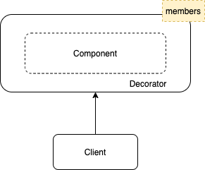
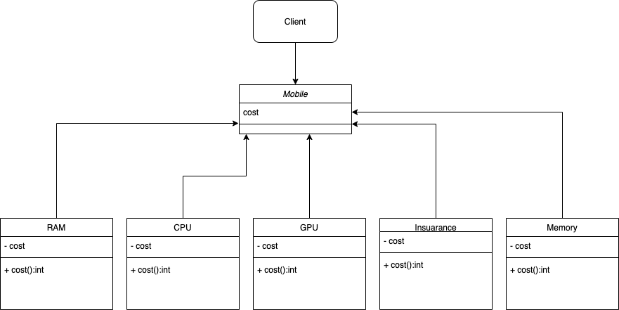

# Decorator Pattern

The decorator design pattern is used to modify the functionality of an object at runtime. In this process, other instances of the same class will not be affected, and multiple decorators can add or override feature to the original object. Decorators provide flexibility to statically typed languages by allowing runtime changes as opposed to the inheritance, which takes place at compile time. 

Here is a the working illustration of the Decorator Pattern:

## JavaScript Example

### Customize Mobile

Here is a UML illustration of `Mobile` implemented as an `Decorator Pattern`.

In this example, we have implemented a custom mobile building application, which helps to customize your new phone and get the estimated budget. It gives you the option to select a hardware configuration according to your needs. In this example, we have a Mobile as an interface, and we have multiple decorators which include `RAM,` `GPU,` `CPU,` `Memory,` and `Insurance.` It performs the required operation during run time and returns the updated value back to the main interface.

### Running the example

This example consists of a front-end written in pure HTML/CSS and contains a form to get input from the client and then hands over to the JS Class to perform the required operation.

In this example the shown final cost is base price without any customization.
  

In this example the shown final cost is being changes according to the customization requested.
 

