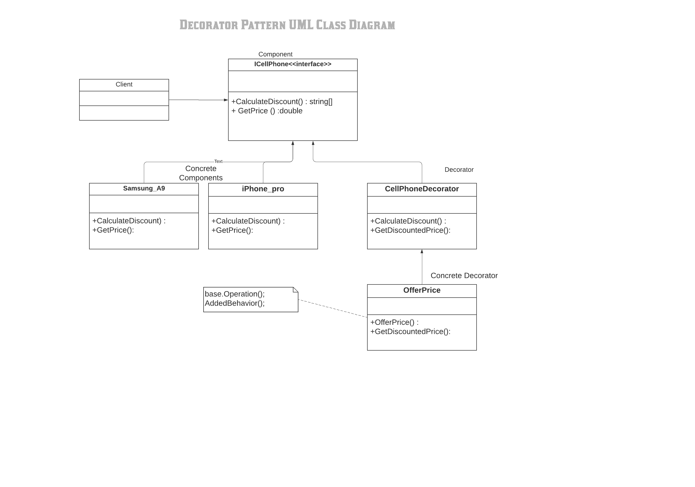

#Decorator Pattern

In object-oriented programming, the decorator pattern is a design pattern that allows behavior to be added to an individual object, dynamically, without affecting the behavior of other objects from the same class. The decorator pattern is often useful for adhering to the Single Responsibility Principle, as it allows functionality to be divided between classes with unique areas of concern.  The decorator pattern is structurally nearly identical to the chain of responsibility pattern, the difference being that in a chain of responsibility, exactly one of the classes handles the request, while for the decorator, all classes handle the request.

Definition

It implements the interface of the extended (decorated) object (Component) transparently by forwarding all requests to it
perform additional functionality before/after forwarding a request.

The decorator pattern can be used to extend (decorate) the functionality of a certain object statically, or in some cases at run-time, independently of other instances of the same class, provided some groundwork is done at design time. This is achieved by designing a new Decorator class that wraps the original class.

The classes and objects participating in this pattern are:

1) Client :
   - Clients use the Component interface to interact with objects

2) Component :
   - Defines the interface for objects that can have responsibilities added to them dynamically.

3) ConcreteComponent :
   - Defines an object to which additional responsibilities can be attached.

4) Decorator :
   - Maintains a reference to a Component object and defines an interface that conforms to Component's interface.

5) ConcreteDecorator :
   - Adds responsibilities to the component.

