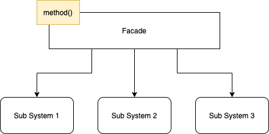
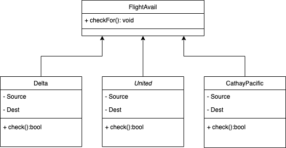
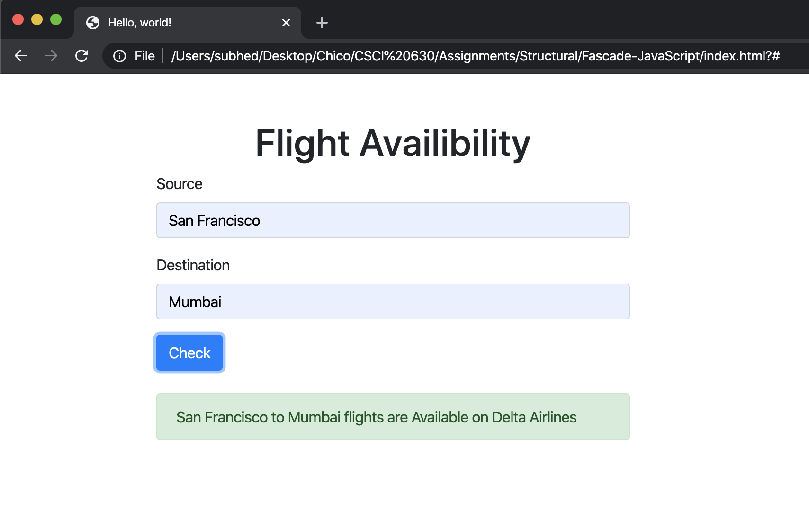
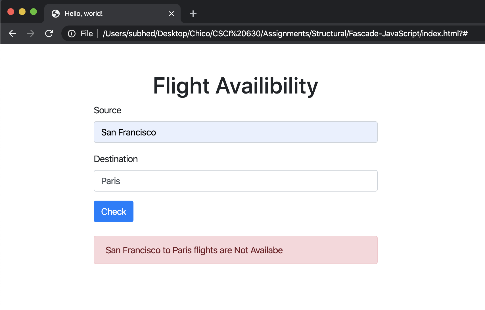

# Facade Pattern

Facade Design Pattern belongs to structural design patterns, and it is nothing but a simple interface of interfaces to simplify interactions between the client code and subsystem classes. The pattern provides an interface which shields clients from complex functionality in one or more subsystems. It hides the complex objects of business and the interaction from the client. This pattern is implemented as a singleton.

Here is a the working illustration of the Facade Pattern:

## JavaScript Example

### Flight Availability Check

Here is a UML illustration of `FlightAvail` implemented as an `Facade Design Pattern`.

In this example, we have implemented a Flight Availability Check application, which checks for flights with different airlines and considering all the airlines gives the first available flight from the source to the destination. In this example, `FlightAvail` is the interface used to get data from the client. The subsystems, in this case, are `Delta,` `United,` and `CathayPacific,` which operate to check for the flight on the requested route. And return bool value if the particular subsystem satisfies the need. In this example, every subsystem functions for the client; in this case, the client does not need to know how the subsystem functions.

### Running the example

This example consists of a front-end written in pure HTML/CSS and contains a form to get input from the client and then hands over to the JS Class to perform the required operation.

 

This example shows that there is Flight Available from Delta Airline. 

 

This example shows that there is Flight Available from United Airline. 

 

This example shows that there is No Flight Available from the source to destination. 
