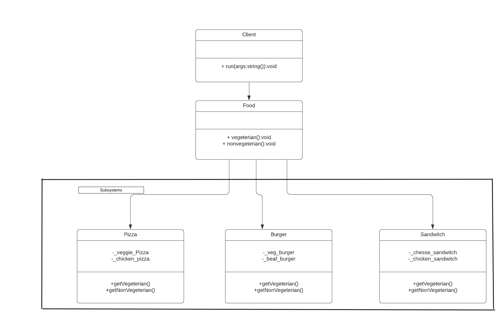
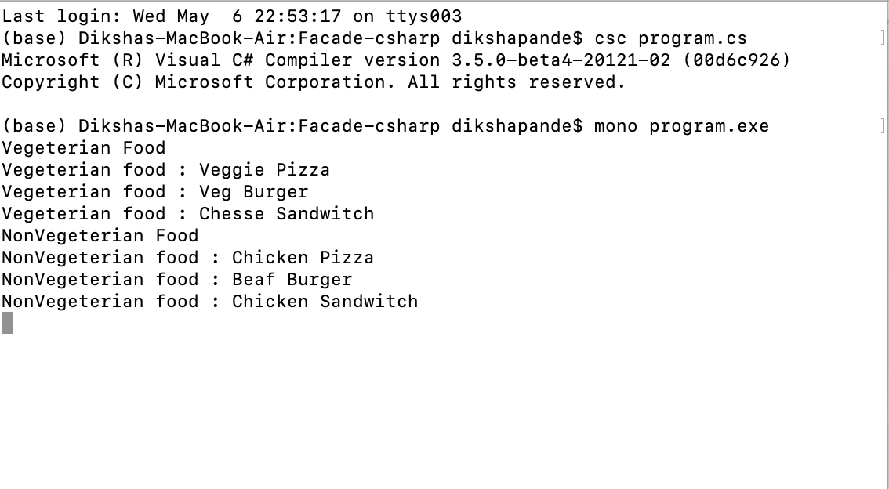

# Facade Factory

+ Facade design pattern comes under structural design pattern category of Gang of four (GoF) design patterns. Facade design pattern is useful when you want to handle a complex system which has multiple independent subsystems. It will provide you an abstraction to implement functionality of the complex subsystem.Facade design pattern provides abstracted view of subsystems by hiding its complexity. It wraps the complex subsystem with a simple interface. This interface is responsible for calling functions of existing subsystems.

+ I am using example of Sandwich and Pizza to explain Facade Factory Pattern. I am writing a program that will work as the single controlling mechanism for ordering Vegeterian and NonVegeterian food. I have created 3 single units of complex subsystem as Pizza, Sandwitch and Burger. I also created a facade class that provides interface for client to access complex subsystem.Then created a constructor of facade class that will instantiate required subsystems.And lastly created Client class to print the Outputs.

# How to run the program
+ This code contains 1 files Program.cs . I used mono to implement C-sharp codes. First command I used to run is csc Program.cs. The second command I used to run is mono Program.exe. You can run the codes in Visual Studio.

# UML Diagram

# Program Output

