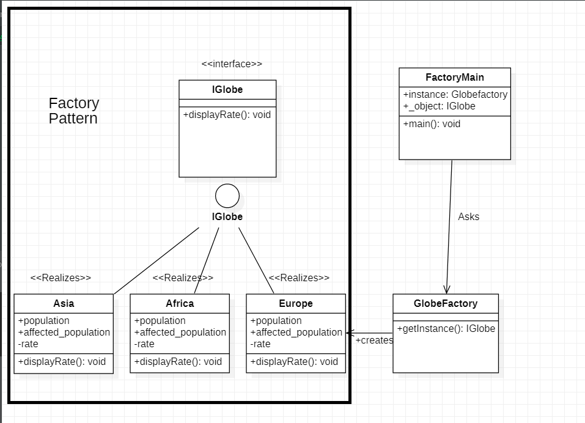

# Factory Pattern

In Factory pattern, we create object without exposing the creation logic to the client and refer to newly created object using a common interface. A real time use of Factory Pattern is when a method returns one of several possible classes that share a common super class. 



## Java example

In this case, I have created the `Globe` interface [IGlobe.java](IGlobe.java), which contains an operation `displayRate` that is a method used to display rate of deaths in different continents. Same method is being used by different continents created -[Asia.java](Asia.java),[Africa.java](Africa.java),[Europe.java](Europe.java). To hide the object creation from the user I have created a Factory class [GlobeFactory.java](GlobeFactory.java) where `getInstance` method checks which object needs to be created which is actually the motive behind hiding creational features from the user.

[FactoryMain.java](FactoryMain.java) class contains the main methos which in turn creates object of the factory class[GlobeFactory.java](GlobeFactory.java) and actually demands which object needs to be created.

### Running the example

The provided [GlobeFactory.java](GlobeFactory.java) file creates multiple classes, but the only ones which are created will be displayed.

```{bash}
$output:
Africa has 0.0625 population affetced by COVID-19
Europe has 0.0026990555 population affetced by COVID-19
```