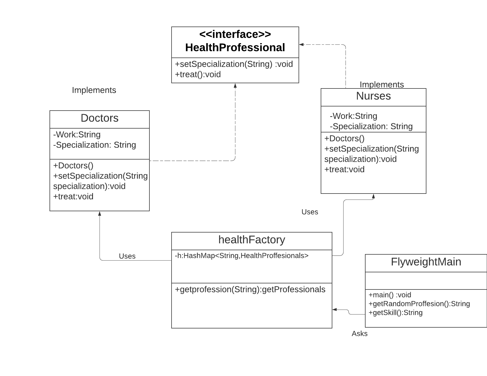

# Flyweight design pattern

Flyweight design pattern provides ways to decrease object count thus improving application required objects structure. Flyweight pattern is used when we need to create a large number of similar objects (say 10^5). One important feature of flyweight objects is that they cannot be modified once they have been constructed. 



## Java example
I have created a `HealthProfessional` interface[HeathProfessional.java](HealthProfessional.java) and concrete classes [Doctors.java](Doctors.java) and  [Nurses.java](Nurses.java)implementing the interface. A factory class [HealthFactory.java](HealthFactory.java) which has a HashMap of Doctors and Nurses. Whenever a request comes to create a Doctors or Nurses of particular color to HealthFactory, it checks the Hashamap object, if object of Doctors found, that object is returned otherwise a new object Nurses is created, stored in hashmap for future use, and returned to client.[FlyweightMain.java](FlyweightMain.java), our demo class, will use HealthFactory to get a Specialization of an object. It will pass information ("Veternary","Neurosurgen","Heart specialist","oncologist") to HealthFactory to get the specialization of desired color it needs.


### Running the example
As you can see in the output the objects Doctors and Nurses are created only once and  for the next time same object is being used.

```{bash}
$output:
Nurse cerated
Nurses wit skills : Veternaty
 with job of: supervise patient and report to doctors
Doctor created
Doctors with specialization: Veternaty
 with job of:  Treat patients and prescribe medicones
Doctors with specialization: Veternaty
 with job of:  Treat patients and prescribe medicones
Doctors with specialization: Heart specialist
 with job of:  Treat patients and prescribe medicones
Nurses wit skills : Heart specialist
 with job of: supervise patient and report to doctors
Doctors with specialization: oncologist
 with job of:  Treat patients and prescribe medicones
Nurses wit skills : Heart specialist
 with job of: supervise patient and report to doctors
Nurses wit skills : oncologist
 with job of: supervise patient and report to doctors
Doctors with specialization: oncologist
 with job of:  Treat patients and prescribe medicones
Nurses wit skills : Neurosurgen
 with job of: supervise patient and report to doctors
```