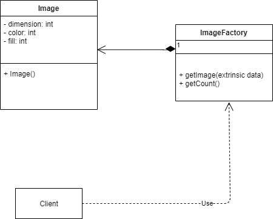
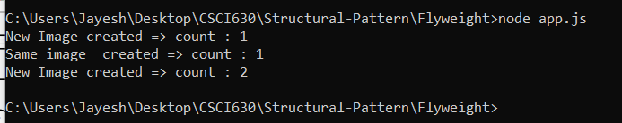

# Flyweight Design pattern

## Definition
	The Flyweight pattern conserves memory by sharing large numbers of fine-grained objects efficiently. Shared flyweight objects are immutable.

## Implementation
1) Create Image class with dimension, color, fill factor in constructor for  images in webpages.
2) Create ImageFactory class as source class for creating images in quantity. 
3) It consist of object which checks for dimension, color, fill in the getImage() function. If same dimension exists then it skips image creation.
4) Function getCount() returns the count for images created in ImageFactory.
5) In result we are providing 3- sets of images two with same argument parameters and one with different parameters.
6) The two images are created uses cached images while 3rd image becomes the newly created image.

## Links
[app.js](./app.js)
[Image.js](./Image.js)
[ImageFactory.js](./ImageFactory.js)

## UML Diagram:

## Output:

## Advantages
1) Maintains intrinsic data to be shared across the application
2) Reduce memory consumption.
