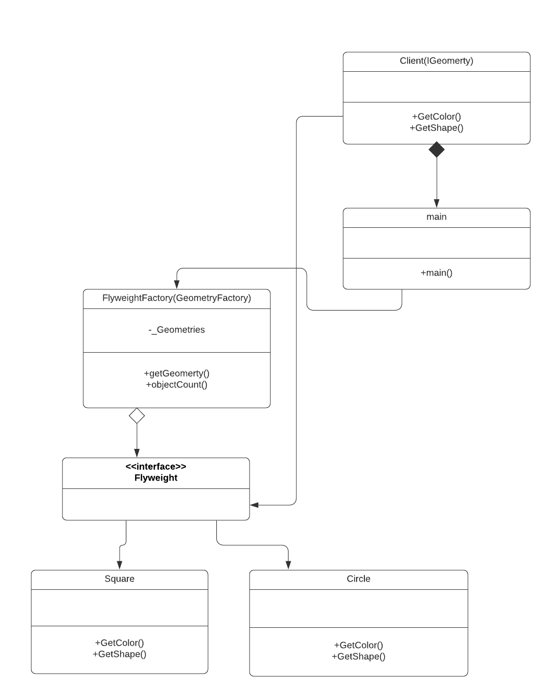
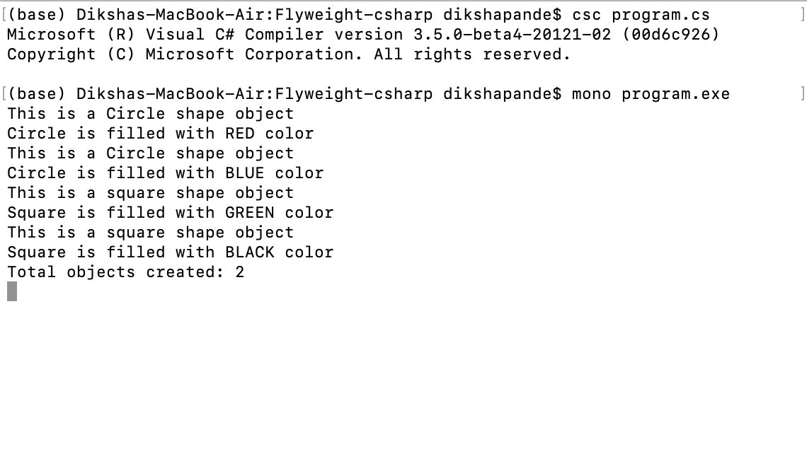

# Flyweight Factory

+ Flyweight pattern comes under structural design pattern category of Gang of four (GoF) design patterns. Flyweight pattern can be helpful when memory is the constraint for your application. It allows you to share the already existing objects and saves memory.Flyweight design pattern is used to reduce numbers of objects created, when there is a need to create large number of objects of mostly similar nature. Since less objects will be created to fulfill the same requirement, it will save the memory and other resources usage in your program; thus performance will be increased.

+ Flyweight design pattern shares already existing similar types of objects. It will create a new object if no matching similar object is found in the application.

+ I am using example of Circle and Square to explain Flyweight Factory Pattern. I am writing a program that to use multiple objects of different geometry shapes in your application like circle or square. These geometries have two features – geometry shape (circle or square) and filled colors (blue, red, black and green). The color will be dependent on the length of the circle or square. The color will be calculated at run time when length of the geometry will be provided. So, in this example color feature is the extrinsic state of flyweight object. On the other hand, shape of geometry is constant and it will be considered as intrinsic state. I have created intrinsic state "Getshape" and extrinsic state "GetColor".The shape of geometry will be constant and color of geometry will dependent on size. Main class is written to print the output.

# How to run the program
+ This code contains 1 files Program.cs . I used mono to implement C-sharp codes. First command I used to run is csc Program.cs. The second command I used to run is mono Program.exe. You can run the codes in Visual Studio.

# UML Diagram

# Program Output

