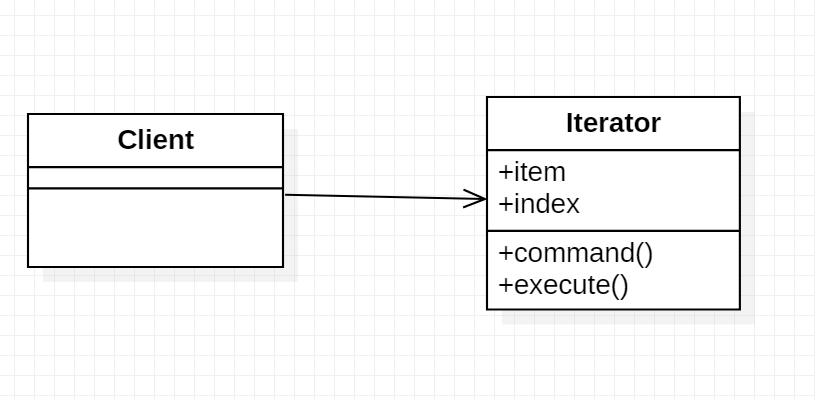

# Iterator Design Pattern

1. The iterator pattern allows us to loop over some collection of objects its a common programming task to iterater over a set of objects may be stored as arrays tree or a graphs.

2. In addition to traverse the collection of items you may need to access the items in the collection in a certain way or order from first to last or last to first depth first or breath first it its a tree or a graph or skip every two elements or skip every three elements ot anything

3. The iterator pattern allows you to write the rules on how to traverse some collectio in this example we will
create an array to iterate.

###### UML


In this example we see a class called math and contains two functions square and cube that returns square of a 
number and cube of a number. there is a command class that will records all the commands that are executed so 
here we will execute the commands square and cube and when we print the commands we can see that we executed square and cube functions.

###### output
```
630
false
Design
4.1
```
