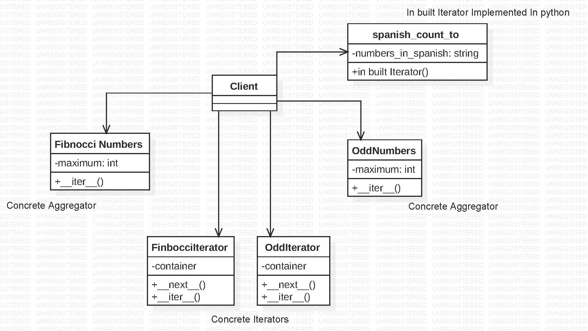

# Iterator

"""
The main goal of this pattern is to provide a way to access the elements of an aggregate objects(list,stack,tree) sequentially
without exposing its underlying representation and put it in an iterator object.
We can add more than one traversing method(eg- Both DFS and BFS for trees) for the same aggregate object through iterator design pattern.
Using this design pattern we can traverse through any underlying datastructure used to represent objects.
Iterator pattern is not only about traversing through a collection, we can provide different kind of iterators based on our requirements.
One of the fundamental features  is that it should allow a client to iterate through a collection, without any knowledge about the implementation of that collection.

# Example:-
The example lists some of the iterators used to traverse respective aggregate objects.
In the example Fibnocci numbers,odd numbers,spanish numbers are aggregating objects. Fibnocci iterator,odd iterator and spanish_count_to iterators are the concrete iterators that traverse through the list of integers and also implement the iterator interface.
In this way different iterators can be used for different pursposes to traverse through the same underlying object.
In python-
__iter__ method takes a container object as its argument and returns a new iterator object.(Fibnocci iterator,spanish number iterator.. in this case)
__next__  method takes the iterator as its argument and each time it is called, returns the next integer from the container.
Along with these "maximum" atrribute is used to limit the scope of the iterator. In this way the iterators created from the respective aggregate objects are used to traverse elements without the need for the client to know the underlying functionality.

 
# Iterator design pattern Output:

Fibnocci Iterator  : [1, 2, 3, 5, 8, 13, 21, 34]
Odd Iterator       : [1, 3, 5, 7, 9, 11]
Even Iterator(> 4) :  {6, 8, 10, 12, 14, 16}
Spanish Numbers Iterator : [uno, dos, tres, cuatro, cinco, seis, siete, ocho, nueve, diez]

