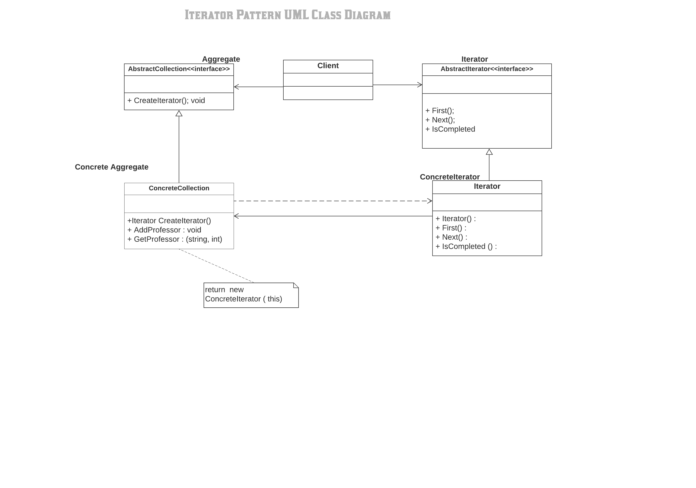

#Iterator Pattern

Overview
- The iterator pattern is a design pattern in which an iterator is used to traverse a container and access the container's elements. The iterator pattern decouples algorithms from containers; in some cases, algorithms are necessarily container-specific and thus cannot be decoupled.

Definition

- The essence of the Iterator Pattern is to "Provide a way to access the elements of an aggregate object sequentially without exposing its underlying representation."

What solution does the Iterator design pattern describe?

- Define a separate (iterator) object that encapsulates accessing and traversing an aggregate object.
- Clients use an iterator to access and traverse an aggregate without knowing its representation (data structures).

The classes and objects participating in this pattern are:

1) Iterator  
-  Defines an interface for accessing and traversing elements.

2) ConcreteIterator
-  Implements the Iterator interface.
-  Keeps track of the current position in the traversal of the aggregate.

3) Aggregate  
-  Defines an interface for creating an Iterator object

4) ConcreteAggregate
-  Implements the Iterator creation interface to return an instance of the proper ConcreteIterator

