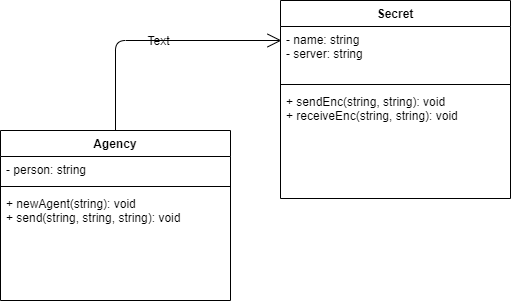
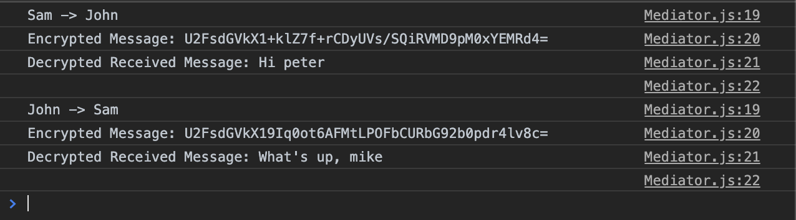

# Mediator Pattern

It is a behavioural design pattern that encapsulates how a set of objects interact with each other. It provides the central authority over a group of objects by promoting loose coupling, keeping objects from referring to each other explicitly.

The Mediator pattern provides central authority over a group of objects by controlling how these objects interact with each other. The `central` object is known as the `mediator`. The mediator pattern is useful in scenarios where every object needs to be aware of any state change in any other object in the group.

## JavaScript Example

### Encrypted Messenger

Here is a UML illustration of `Agency` implemented as an `Mediator Design Pattern`.

In this example, we have developed `Encrypter Messenger` application, which encrypts `Message` to `Secret Message` This example consists of Mediator Interface, which takes input from the sender, which includes the message and the key being used for encryption. Then it gives it to the Colleagues, which is `Secret,` and then sended to the send function, which then pushes the message to receiver. In this example, we get two outputs one shows the encrypted text senr and another is on the receiver's end decrypted message.

### Running the example

In this output we can see Sam and John are chatting over encrypted chatting service.  

