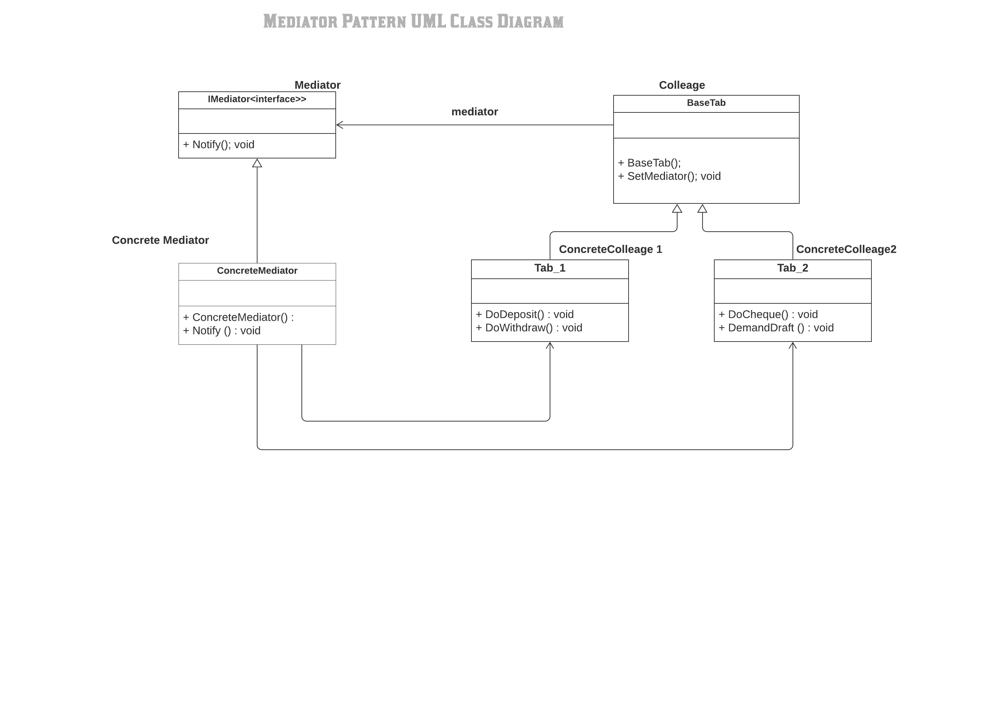

#Mediator Pattern

The mediator pattern defines an object that encapsulates how a set of objects interact. This pattern is considered to be a behavioural pattern due to the way it can alter the program's running behaviour.

With the mediator pattern, communication between objects is encapsulated within a mediator object. Objects no longer communicate directly with each other, but instead communicate through the mediator. This reduces the dependencies between communicating objects, thereby reducing coupling.

Definition

- The essence of the Mediator Pattern is to "define an object that encapsulates how a set of objects interact". It promotes loose coupling by keeping objects from referring to each other explicitly, and it allows their interaction to be varied independently.[3] Client classes can use the mediator to send messages to other clients, and can receive messages from other clients via an event on the mediator class.

What solution does the Mediator design pattern describe?

- Define a separate (mediator) object that encapsulates the interaction between a set of objects.
- Objects delegate their interaction to a mediator object instead of interacting with each other directly.

The classes and objects participating in this pattern are:

1) Mediator  
-  Defines an interface for communicating with Colleague objects

2) ConcreteMediator  
-  Implements cooperative behaviour by coordinating Colleague objects
-  Knows and maintains its colleagues

3) Colleague classes  
-  Each Colleague class knows its Mediator object
-  Each colleague communicates with its mediator whenever it would have otherwise communicated with another colleague

