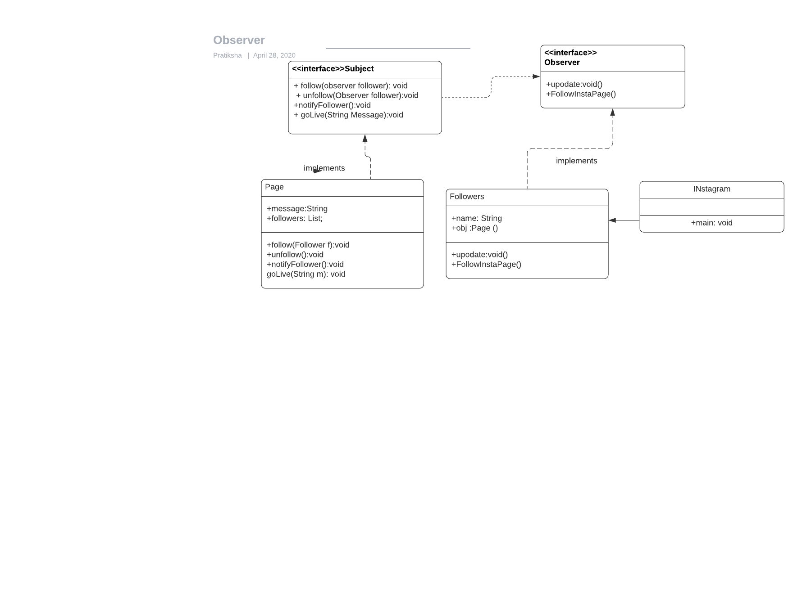

# Observer design pattern

Observer pattern is used when there is one-to-many relationship between objects when there is obects dependent on one object. In this case dependent objects are notified of the updattions that are made on the object on which every other object is dependent. 
Observer pattern uses three actor classes. 
The Observer Pattern defines a one to many dependency between objects so that one object changes state, all of its dependents are notified and updated automatically.
Advantages:
-Subject only knows that observer implement Observer interface.Nothing more.
-There is no need to modify Subject to add or remove observers.
-We can reuse subject and observer classes independently of each other.



## Java example
I have created a `Subject` interface[Subject.java](Subject.java) where a `Page` class [Page.java](Page.java) implements the subject which has methods to follow particular instagram page, unfollow, notify of the live sessions. An Observer interface [Observer.java](Observer.java) is implemented by the followers who are observing changes to the Subject that is our instagram page. Whenever there is a page goin live Page which is a subject will call an update method which will notify each follower
Subject-[Subject.java](Subject.java) is an object having methods to attach and detach observers to a client object.
I have created an abstract class Observer and a concrete class Subject that is extending class Observer those are Observer[Observer.java](Observer.java) and Client[Followers.java](Followers.java).

### Running the example
As you can see in the example Each follower is been notified as soon as Subject that is instagram page is going live.

```{bash}
$output:
Hey Pratiksha Going live
Hey Zaiba Going live
Hey Diksha Going live
Hey Deepali Going live
Hey Piradeepan Going live
Hey Harshal Going live
Hey Jayesh Going live
Hey Sujeet Going live
Hey Ross Going live
Hey Rachel Going live
Hey Diana Going live
Hey Jaxon Going live
Hey Grace Going live
```