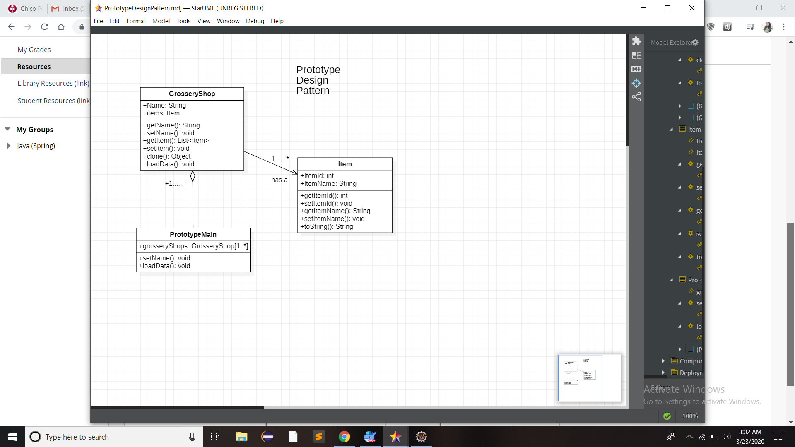

# Prototype Design

Prototype pattern refers to creating duplicate object while keeping performance in mind. This type of design pattern comes under creational pattern as this pattern provides one of the best ways to create an object in terms of avaoiding time delays due to data load from database.

This pattern involves implementing a prototype interface which tells to create a clone of the current object. This pattern is used when creation of object directly is costly. For example, an object is to be created after a costly database operation. We can cache the object, returns its clone on next request.



## Java example

In this case, I have created the `Item` class [Item.java](Item.java), Which represents items in the grosserry shop having properties such as ItemName and ItemId. [GrosseryShop.java](GrosseryShop.java) maintains the items in it. The scenario is that in future there is need to create another grosseryshop very similar to what is now. In this case instead of calling costly database queries and loading data we can just clone/ copy current object, for this I have implemented `Cloneable` interface so as to use its clone methos to copy the object.For now I have [loaded data from loadData method](GrosseryShop.java#L47).  

[PrototypeMain.java](PrototypeMain.java) class contains the main method where I have created an object of `GrosseryShop` and loaded data from the `loadData`. Now I have to clone thiss object into another object using `clone` and displayed the results.

### Running the example

Following are the results of two objects winco and walmart. As I have created a `shallow copy` of the first object, The second copy refers to the same object, which means if I remove or add anything to the first reference automatically it will be updated in the scond. The better solution to avoid this is to make `deep copy`.

```{bash}
$output:
GrosseryShop [name=Winco, items=[Item [itemId=0, itemName=Book0], Item [itemId=1, itemName=Book1], Item [itemId=2, itemName=Book2], Item [itemId=4, itemName=Book4]]]
GrosseryShop [name=Walmart, items=[Item [itemId=0, itemName=Book0], Item [itemId=1, itemName=Book1], Item [itemId=2, itemName=Book2], Item [itemId=4, itemName=Book4]]]

```