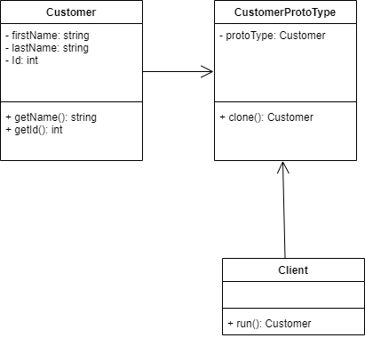

# Prototype Design pattern

## Definition
  The Prototype Pattern creates new objects, rather than creating non-initialized objects it returns objects that are initialized with values it copied from a prototype

## Implementation
1) JavaScript being a prototypal language uses this pattern in the construction of new objects and their prototypes.
2) Customer object data is cloned using CustomerProtoType object.
3) Customer object consists of id, first name and lastName attributes.
4) CustomerProtoType type accepts the argument as Customer. Calling the clone method will generate a new Customer object with its property values initialized with the prototype values.
5) Customer first name and Id will be displayed in output.

## Links
[app.js](./app.js)
[Customer.js](./Customer.js)
[CustomerProtoType.js](./CustomerProtoType.js)

## UML Diagram:

## Output:

## Advantages
1) Prototype object initialization helps business objects with values that match the default values in the database.
