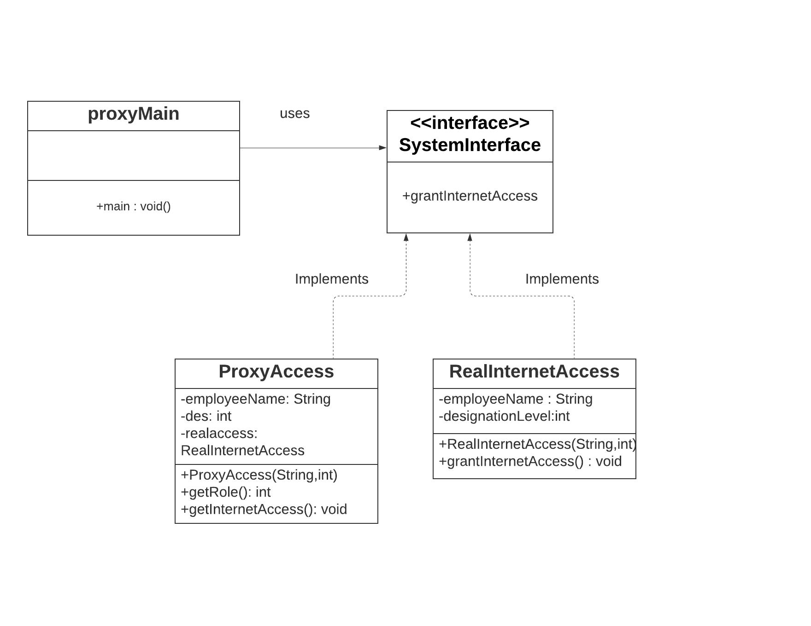

# Proxy Pattern

The Proxy pattern allows us to create an intermediary that acts as an interface to another resource, while also hiding the underlying complexity of the component.


## Java example

I have created an [SystemAccess.java](SystemAccess.java) interface and concrete classes implementing the interface. [ProxyAccess.java](ProxyAccess.java) is a a proxy class to limit access to the system for employees having certain level of designation in the company.

Using this Proxy Access we have achieved limiting access to the important functionality of the system. It could be anything in the real world which involves  security concer such as revealling too much information regarding ATM transactions, SSN details, Access to systems, Admin level permissions for databases etc.

[FactoryMain.java](FactoryMain.java) class contains the main methos which in turn creates object of the factory class[GlobeFactory.java](GlobeFactory.java) and actually demands which object needs to be created.

### Running the example

As you can see in the output there is a limitation on the access just ny knowing the designation of the employee by its name by `getRole` method. `grantInternetAccess` gives access to the employees of certain designation from the proxy class.

```{bash}
$output:
No Internet access granted. Your job level is below 5
Internet Access granted for employee: John With destignation level of 10

```