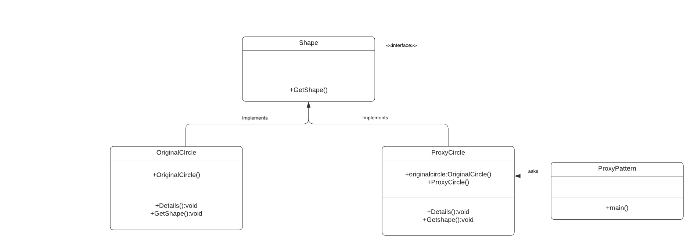
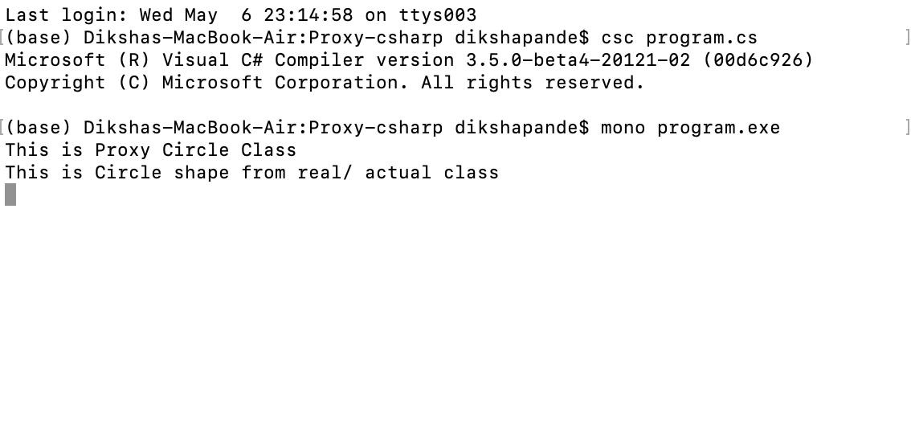

# Proxy Factory

+ Proxy pattern is helpful if you want to access objects of that is not available in same application code or in the same machine or in same network, they can have present in different application that is present in some other machine at different locations.

+ Proxy can be divided into three types based on their requirement:

Remote Proxies: These proxies are responsible for representing objects located at remote locations or different networks. This is similar to the proxy class in WCF where client at different networks/ locations uses proxy class instance to access web services.
Virtual Proxies: These proxies are used when the actual class object is very heavy or complex object. Virtual proxy will provide some instant access of the actual object by instantiating it on demand. Since instantiation of actual object will be expensive in terms of memory, so it will be represented with proxy class. When the requirement comes then only actual object will be instantiated.
Protection Proxies: These proxies are used as the proxy server to restrict access of resource. Most of the organizations uses this proxy to restrict the access of the user in their network.

+ I am using example of CircleShape to explain Proxy Factory Pattern. I am creating a interface class getshape() which is implemented by both the actual class and proxy class, that's why proxy class can substitute the actual class. It is the common interface for actual and proxy class.The originalCircle class is the actual class which is represented by proxy class. ProxyCircle class represents actual class.Finally I wrote a main class to print all the details on terminal output.

# How to run the program
This code contains 1 files program.cs . I used mono to implement C-sharp codes. First command I used to run is csc Program.cs. The second command I used to run is mono Program.exe. You can run the codes in Visual Studio.

# UML Diagram

# Program Output

