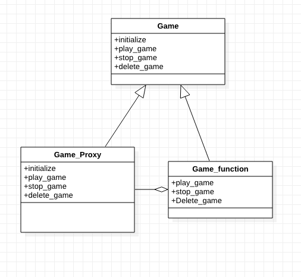

# Proxy

Proxy means ‘in place of’,or ‘instead of’ are literal meanings of proxy and that directly explains Proxy Design Pattern.
Proxies are also called surrogates, handles, and wrappers. They are closely related in structure, but not purpose, to Adapters and Decorators.

A real world example can be a cheque or credit card is a proxy for what is in our bank account. It can be used in place of cash, and provides a means of accessing that cash when required. And that’s exactly what the Proxy pattern does – “Controls and manage access to the object they are protecting“.




## Running the Example

To execute the program from command line, please use the following command:

```{bash}
% ruby proxy_design_pattern.rb
 Game Details:
 Name: PUBG
 Size: 38 GB
 Creator: Player Unknown BattleGround
Playing Game: PUBG
Stopping Game: PUBG
Deleting game: Back off Not allowed!!!
Unable to perform record_game on Game object
```
