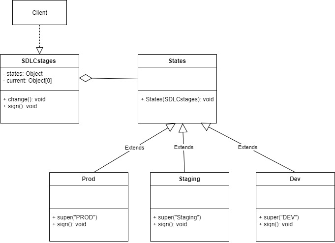

# State Design Pattern

State pattern is one of the behavioral design pattern. State design pattern is used when an Object changes its behavior based on its internal state.

1. It is a behavioural design pattern that allows an object to alter its behaviour based on changes to its internal state. The object returned by a state pattern class seems to change its class. 

2. It provides state-specific logic to a limited set of objects in which each object type represents a particular state.

3. We will take a simple example of a Software Development stages to understand this pattern. The Stoftware Development class changes the object it returns based on its internal state, which is an object of testing, Commiting, or Coding class.

##### UML


###### Output
```
Development Coding
Staging Commits
Production Testing
Development Coding
Staging Commits
Production Testing
```