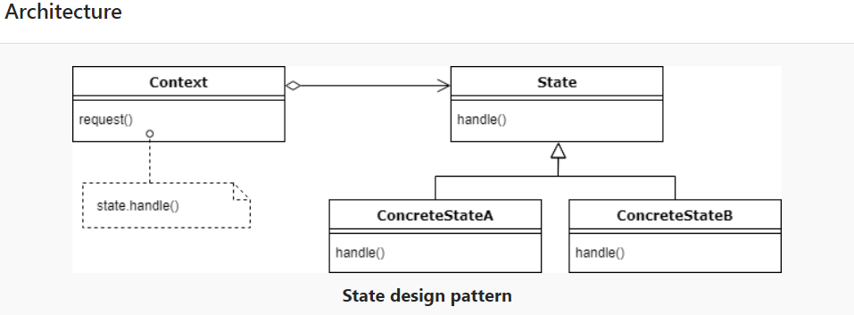
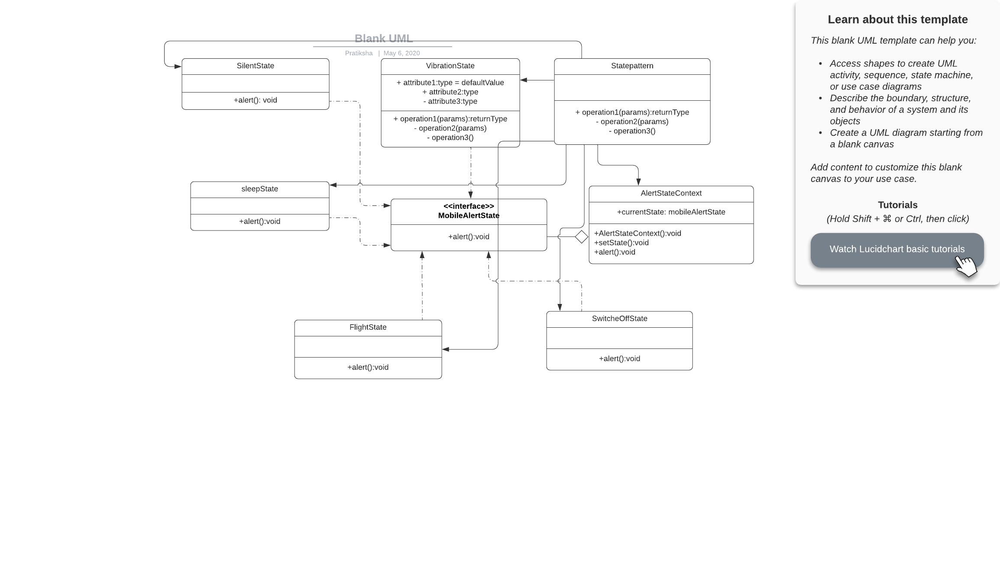

# State Design Pattern

This is a behavioural pattern as it defines a manner for controlling communication between classes or entities.

The state pattern is useful when creating object-oriented state machines, where the functionality of an object changes fundamentally according to its state. By using multiple concrete classes, each inheriting from the same base class, large differences in functionality are possible without resorting to numerous "if" or "switch" statements.

The state pattern is also known as objects for states. So, we can assume that more states need more codes, and the obvious side effect is difficult maintenance for us.




## Java example
In this example I have created a State class which is [MobileAlertState.java](MobileAlertState.java) which has a method `alert()` implemented by all the concrete classes listed below. 
I have defined an interface (state) for performing state-specific behavior, and define classes that implement the interface for each state. Those are [Sleep.java](Sleep.java), [Vibration.java](Vibration.java), [SwitchedOff.java](SwitchedOff.java), [Flight.java](Flight.java), [Silent.java](Silent.java)
The MobileStateAlert pattern does not specify where the state transitions will be defined. The choices are two: the “context” object, or each individual State derived class.

### Running the example
```{bash}
$output:
On vibration...
On vibration...
Choose state from choices
-------------------------

1 - Select Silent
2 - Select Vibration
3 - Select Switched off
4 - Select Flight
5 - Select Sleep
1
On silent...
2
On vibration...
3
On SwitchedOFff mode...
4
On Flight mode...
5
On Sleep mode...

```