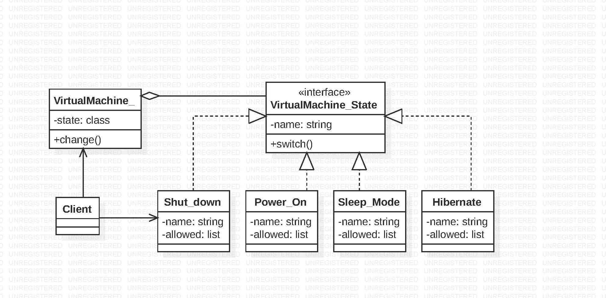

# State Design Pattern

State Pattern allow an object to alter its behavior when its internal state changes.
The object will appear to change its class.The state pattern is used in computer programming to encapsulate varying behavior for the same object, based on its internal state.It also follows - adding new states should not affect the behavior of existing states.
The State pattern lets you reduce code duplication by extracting common code into abstract base classes.
Cons- Applying the pattern can be draining memory if a state machine has only a few states or rarely changes.

# Example:-
In this example, the State pattern lets the virtual machine change its state differently, depending on if the state requested to switch is present in allowed list.VirtualMachine_State is the interface for encapsulating the behavior associated with a particular state of the virtual machine. All the other subclasses like shut_down,hibernate,power_on implement a behavior associated with a state of the VM. The VirtualMachine_ class is present to change the current state of the virtual machine object based on the different states(shut_down,hibernate,power_on) passed to it.

# State Design Pattern Output:
Present State: Shut_down   ->   State is changed to - Power_On
Present State: Power_On   ->   State is changed to - Sleep_Mode
Present State: Sleep_Mode  ->   State change to hibernate not possible.
Present State: Sleep_Mode   ->   State is changed to - Power_On
Present State: Power_On   ->   State is changed to - Shut_down