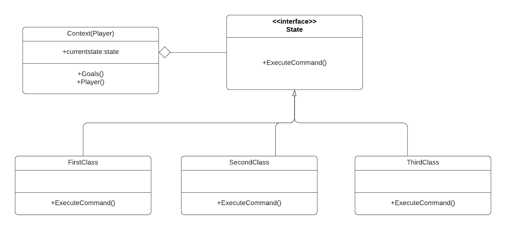
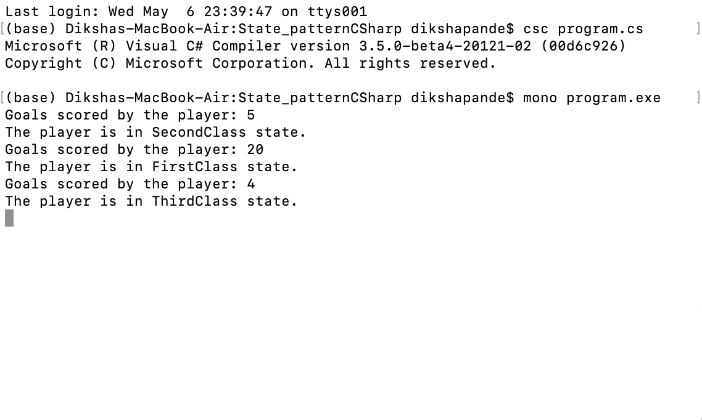

# State Design pattern

+ State pattern comes under behavioral design pattern category.tate pattern is useful when we want to maintain various states for a scenario in our program. State pattern allows an object to change its behavior when it’s internal state changes.This pattern is used when there are one too many relationships between objects such as if one object is modified, its dependent objects are to be notified automatically. State Design Pattern is used to alter the behavior of an object when it’s internal state changes. In this pattern, an object is created which represent various states and a context object whose behavior varies as it's state object changes.

+ To explain this design pattern I took the example of the Soccer players. Differentiating the players for selection by the number of goals scored by them. I have 3 conditions 1) If the number of goals scored by a player are less than 5 then he/she is in ThirdClass state. 2) If the number of goals are between 5 and 10 then he/she is in SecondClass state. 3) If the number of goals are greater than 10 then he/she is in ThirdClass state.For any State Design Pattern their are mainly 3 parts :1)Context class 2)Interface 3)Concrete state classes. So for this example the Context class is player class, the interface class is StateBehaviour and the concrete classes are FirstClass,SecondClass and ThirdClass. The context class Player holds the object of concrete state object that changes its state. So, state of context class object is also changed. The StateBehaviour interface defines the behavior associated with a state of the context object. The other 3 concrete classes represents the state of the context object.Each of them implements a behavior associated with a state of context.

# How to run the program
+ This code contains 1 files Program.cs . I used mono to implement C-sharp codes. First command I used to run is csc Program.cs . The second command I used to run is mono Program.exe. You can run the codes in Visual Studio.

# UML Diagram

# Program Output

