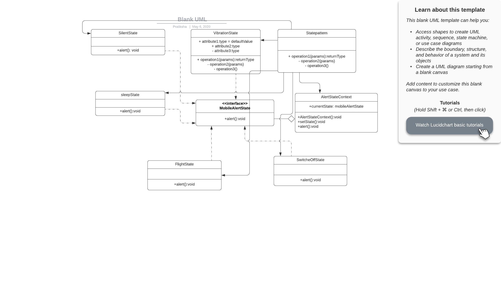

# State Design Pattern

This is a behavioural pattern as it defines a manner for controlling communication between classes or entities.

The state pattern is useful when creating object-oriented state machines, where the functionality of an object changes fundamentally according to its state. By using multiple concrete classes, each inheriting from the same base class, large differences in functionality are possible without resorting to numerous "if" or "switch" statements.

## Java example

