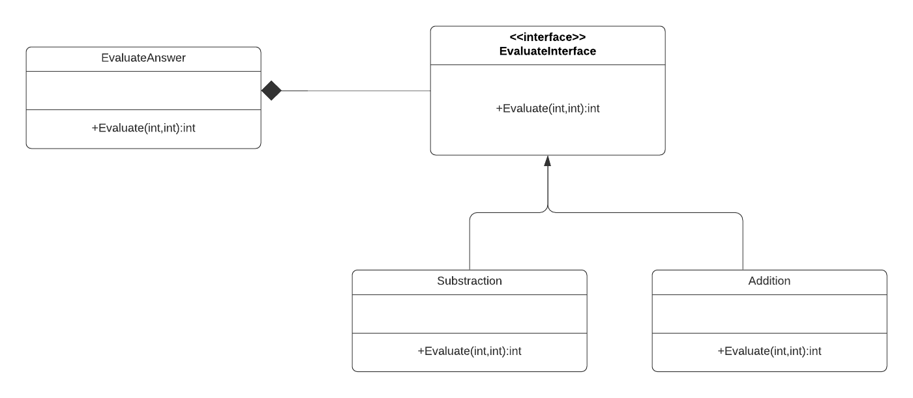
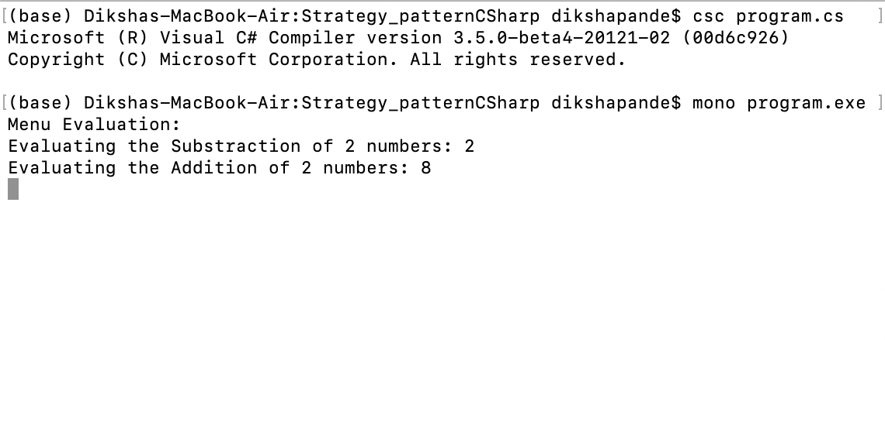

# Strategy Design pattern

+ The Strategy design pattern defines a family of algorithms, encapsulates each one, and makes them interchangeable. Strategy lets the algorithm vary independently from clients that use it.The intent of the Strategy design pattern helps us to divide an algorithm from a host class and then move it to another class. By doing so the client can choose which algorithm will be performed in runtime from a set of algorithms that were implemented earlier.There are common situations when classes differ only in their behaviour. For this case, it is a good idea to isolate the algorithms in separate classes in order to have the ability to select different algorithms at runtime. The Strategy pattern allows us to provide an alternative to subclassing the Context class to get a variety of algorithms or behaviours, eliminates large conditional statements and provides a choice of implementations for the same behaviour.

+ A class defines many behaviors, and these appear as multiple conditional statements in its operations. Instead of many conditionals, move related conditional branches into their own Strategy class. To describe this design pattern I took the example of Addition and Substraction. First I have created a Context class(EvaluateAnswer) which is configured with a ConcreteStrategy object, and maintains a reference to a Strategy object and may define an interface that lets Strategy access its data. Then I have created a Interface EvaluateInterface that declare an interface common to all supported algorithms. Cotext uses this interface to call the algorithm using the Strategy interface. Two ConcreteStrategy classes(Addition and Substraction) are created to implement the algorithm using the Strategy Interface.

# How to run the program
+ This code contains 1 files Program.cs . I used mono to implement C-sharp codes. First command I used to run is csc Program.cs . The second command I used to run is mono Program.exe. You can run the codes in Visual Studio.

# UML Diagram

# Program Output

