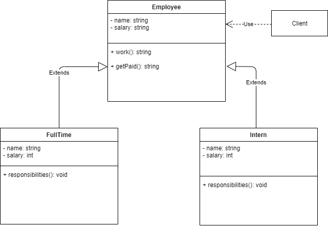
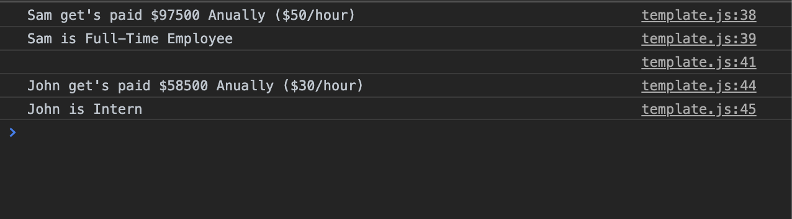

# Template Design Pattern

This is a behavioural design pattern based on defining the skeleton of the algorithm or implementation of an operation, but deferring some steps to subclasses. It lets subclasses redefine certain steps of an algorithm without changing the algorithm’s outward structure.

## JavaScript Example

### Salary Calculator

Here is a UML illustration of `Salary Calculator` implemented as an `Template Design Pattern`.

In this example, we have developed `Salary Calculator` application, which gives `Anual Salary` depending upon `Salalry Per Hour`. This example consists of Template Class Employee that implements workmethod partially, In this example we have two subclasses `Full-Time` and `Intern` that extends template class and implement the required method to fill the implementation gap.

### Running the example

In this output we can see Full-Time and Intern salary been calculated and displayed.  

