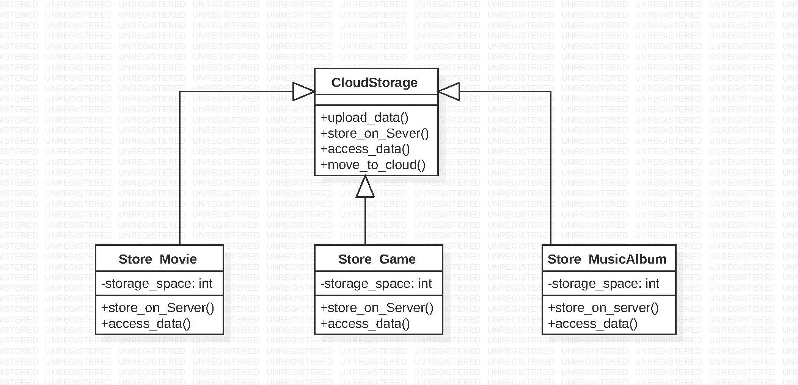

# Template Method

Template method defines the structure of an algorithm in an operation, deferring some
steps to subclasses. It lets subclasses redefine certain steps of an algorithm 
without changing the algorithm's structure. 
When to use
* To implement the similar parts of an algorithm once and leave it up to subclasses to implement the behavior that can vary from class to class.
* when common behavior among subclasses should be factored and localizedin a common class.
* To control subclasses extensions and avoid code duplication.

# Example :-
This pattern is used for storing various forms of data on the cloud. If the storage capacity is full for respective data, it can'nt be saved. All the forms of data(Movie,game.etc) are stored on the server and accessed the same way(common functionalities) but these data are saved on cloud based on storage space. Since the variation of storage space is checked in the later stages and data is saved and accessed the same way for all items,so template design pattern is used here. Here cloud storage is the abstract template class, Store_Movie and Store_Game are the concrete classes that override the abstract class but not change its structure.
 
# Template design pattern Output:

Requesting to save Data on cloud.....
1. Saved Game on remote server.      
2. Ready to Play.
***********************************  
Requesting to save Data on cloud.....
1. Saved Music Album on remote server
2. Ready to Play Album.
***********************************
Requesting to save Data on cloud.....
Not enough space to save.Purchase more storage space!
