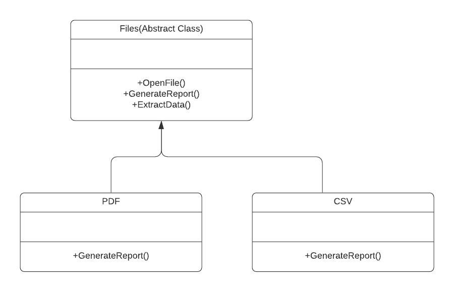

# Template Design pattern

+ Template pattern is useful when you want to implement an algorithm but some steps of the algorithm can vary upon the requirement.Template pattern provides the skeleton to implement an algorithm and the steps to implement the algorithm can be overridden by implementing class i.e. sub-classes can redefine the steps without altering the original structure of the algorithm.Define the skeleton of an algorithm in an operation, deferring some steps to subclasses. Template Method lets subclasses redefine certain steps of an algorithm without changing the algorithm’s structure.

+ To explain this design pattern I took the example Data mining of a file. I have created an Abstract class Files, this class defines PrimitiveOperations and TemplateMethod. PrimitiveOperations are abstract methods that is implemented by ConcreteClass to redefine the steps of the algorithm. TemplateMethod defines skeleton of the algorithm and this method calls primitive operation methods. I considered File's data mining for two different type of files PDF file and CSV file. To support different formats of file we required 2 different ways to generate report of file analysis. To use any file we need to open the file.This step is common for both file formats, so it will be default state.Once the file is opened we have to extract the data which is common for both the files PDF and CSV. Now we want to generate a analysis report for both the files, we want the analysis report of PDF file in PDF form while the analysis report of CSV file in TXT form, this step will vary for different formats. So I have created two Concrete class: PDF and CSV.

# How to run the program
+ This code contains 1 files Program.cs . I used mono to implement C-sharp codes. First command I used to run is csc Program.cs . The second command I used to run is mono Program.exe. You can run the codes in Visual Studio.

# UML Diagram

# Program Output

