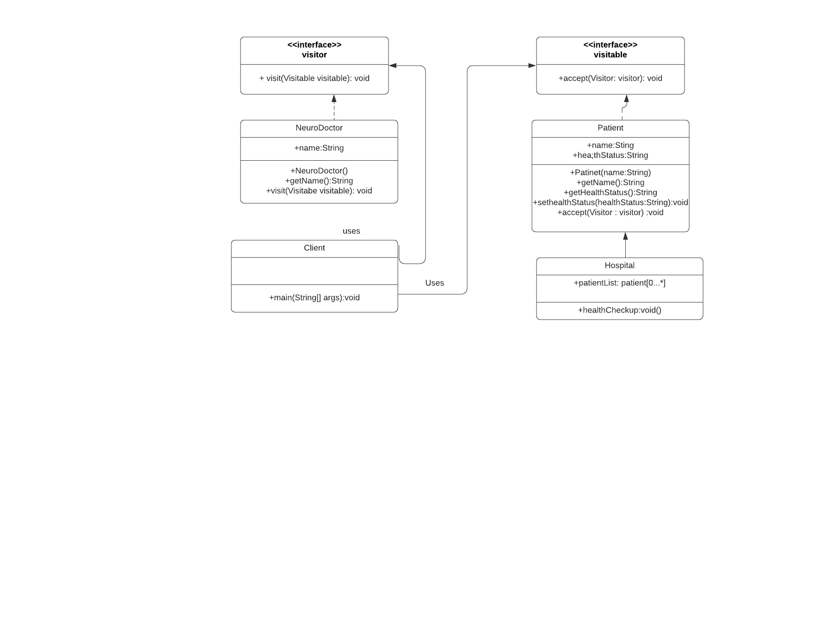

# Visitor design pattern

Visitor is a behavioral design pattern that lets you separate algorithms from the objects on which they operate.
Allows to add methods to classes of different types without much altering to those classes. Allows to define external classes that can extend other classes without majorly editing.  
The Visitor pattern lets you execute an operation over a set of objects with different classes by having a visitor object implement several variants of the same operation, which correspond to all target classes.


## Java Example

I have created Visitable interface which has accept method, Patient[Patient.java](Patient.java) a concrete class implements [Visitable.java](Visitable.java). I have defined another visitor class [visitor.java](visitor.java) which has `visit` method implemented by [NeuroDoctor.java](NeuroDoctor.java) where it determined if our visitors i.e Patients are in good health or bad health. 


### Running the example

```{bash}
$output:
Neuro surgeon Dr. Will Smith did the check up of the patient - Pratiksha found health is serious
Neuro surgeon Dr. Will Smith did the check up of the patient - Pranav found health is serious
Neuro surgeon Dr. Will Smith did the check up of the patient - Uttkarsh found health is serious
Neuro surgeon Dr. Will Smith did the check up of the patient - Ujjwal found health is serious
```