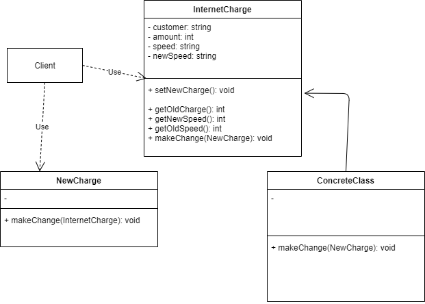
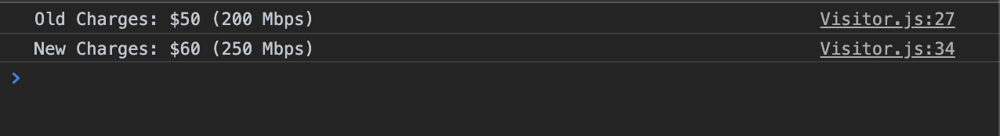

# Visitor Design Pattern

The Visitor pattern allows you to add or define new functionality to an object without changing the code for that object. The new logic resides in a external object or function called the 'visitor'.

Visitors are useful when you are trying to extend the functionality of a library or framework. If the object you want to extend provides some kind of 'accept' method that accepts a visitor object/function, you can grant the visitor object access to the receiving object's internal properties. The visitor can then modify the behavior of the receiving object. This pattern allows you to provide an easy way for clients to implement future extensions to that object.

## JavaScript Example

### Salary Calculator

Here is a UML illustration of `Internet Charge Calculator` implemented as an `Visitor Design Pattern`.

In this example, we have developed `Internet Charge Calculator` application, which gives `Total Amount` depending upon `Internet Speed`. This example consists of Function `setNewCharge` that calculates the new amount to be charged depending upon the speed, In this example we have two charges shown first is for `200 Mbps` and second is for `250 Mbps`.

### Running the example

In this output we can see amount for 200 Mbps and amount for 250 Mbps been calculated and displayed.  

