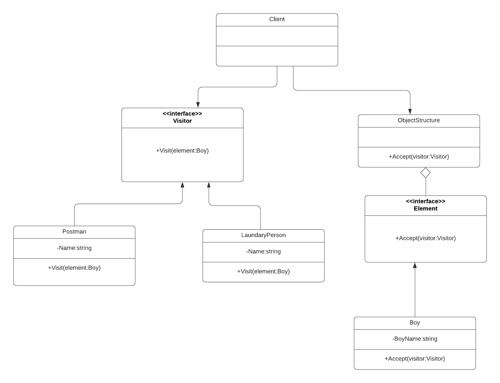
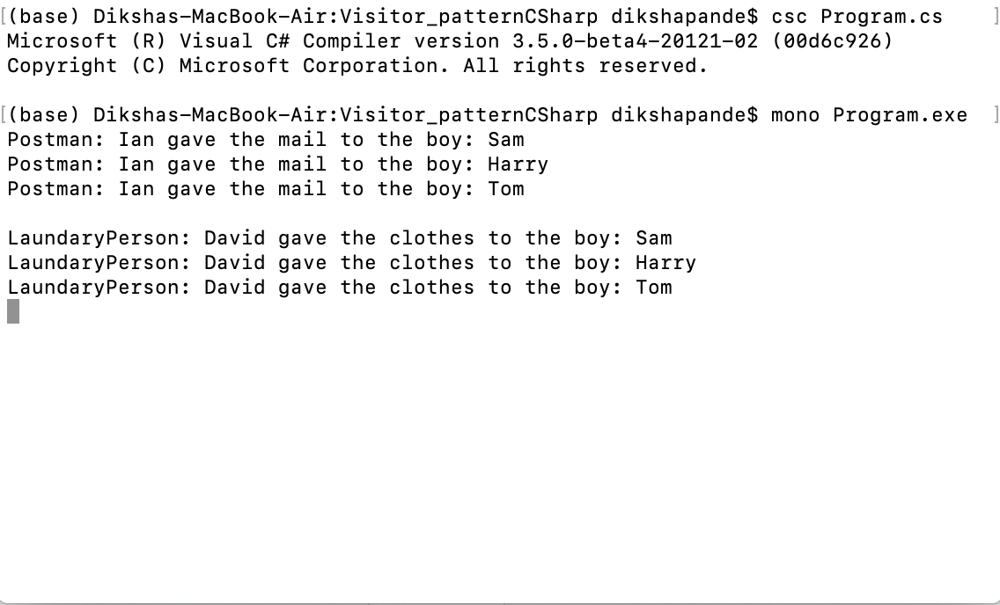

# Visitor Design pattern

+ The Visitor design pattern lets us operate on objects by representing that operation as an object unto itself. Thereby, we can operate on said objects without changing the classes or definitions of those objects.This pattern is particularly useful when, for one reason or another, we cannot modify or refactor existing classes but need to change their behavior.The Visitor Design Pattern should be used when you have distinct and unrelated operations to perform across a structure of objects (element objects). This avoids adding in code throughout your object structure that is better kept separate.

+ To explain this design pattern I took an example of Postman and LaundaryPerson giving mails and clothes to the boys in the society. I created a interface that declares an Accept method which takes the base Visitor interface as an argument. A concrete class which implements the Accept method defined by the IElement interface. Another interface IVisitor that declares a method for each Concrete Element in the object structure. Concrete Visitors class for Postman and LaundaryPerson each implements the operation defined by the IVisitor interface. These are the subclasses that implement each operation declared by the IVisitor interface. Each operation implements a fragment of the algorithm defined for the corresponding class or object in the structure. Public class Society which provides interface to allow the Visitor to visit its elemtns. This is a class that holds all the elements (boys) and provides a high-level interface that allows the visitor to visit all the elements.

# How to run the program
+ This code contains 1 files Program.cs . I used mono to implement C-sharp codes. First command I used to run is csc Program.cs . The second command I used to run is mono Program.exe. You can run the codes in Visual Studio.

# UML Diagram

# Program Output

