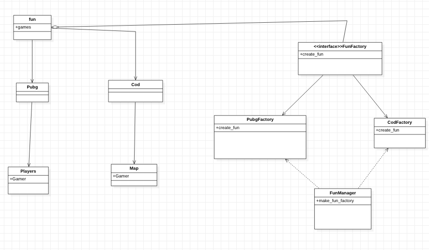

# Abstract_Factory

The implementation of abstract factory method discussed in the game_fun example demonstrates the Abstract Factory method pattern. <br>

The first thing the Abstract Factory pattern suggests is to explicitly declare common interfaces for each distinct product of the product family. <br>

The next  is to declare the Abstract Factory—an interface with a list of creation methods.<br>



## Running the example

The provided [abstract_factory.rb](abstract_factory.rb)

```{bash}
$ ruby abstract_factory.rb
players
boring
players
```