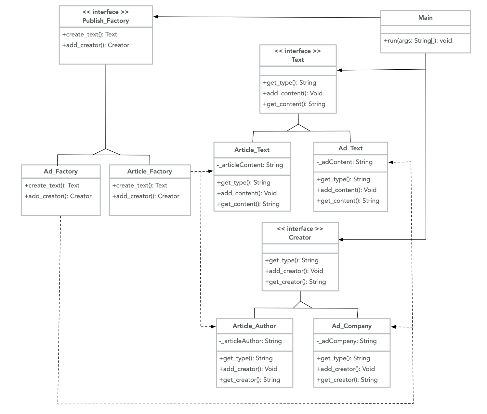

# Abstract Factory

Abstract Factory is a creational design pattern that provides interfaces for creating related groups of objects without specifying concrete classes. An Abstract Factory ensures that the look-and-feel of the related objects remain the same; thus, a client may interact with the abstract factory and abstract product interfaces, but will not interact or alter the implementation of the concrete factory and products themselves. In addition, the client does not need to be concerned with any dependencies between the concrete classes, because Abstract Factory automatically enforces them.

A practical use of the Abstract Factory pattern could be for a magazine publisher. The magazine includes articles and ads; both types of content are composed of text and have a creator (author or company). Here is a UML illustration of `Publish_Factory` implemented as an Abstract Factory.



## Java Example

To use the Abstract Factory pattern, a number of components must be included. These include:
* Abstract Factory // interface for operations that create abstract objects
  * in this example: [Publish_Factory](Publish_Factory.java) creates products that all have Text and a Creator. To get the concrete products, a client can call the creation functions in the Publish_Factory interface.
* Concrete Factories // implement the Abstract Factory operations
  * in this example: [Ad_Factory](Ad_Factory.java) and [Article_Factory](Article_Factory.java) implement the Publish_Factory operations to create the concrete product variants (either Ad or Article) described in the Text and Creator interfaces.
* Abstract Products // each is an interface for a family of objects
  * in this example: [Text](Text.java) and [Creator](Creator.java) are the common interfaces for their respective related concrete products (Ad or Article Content (Text), Ad Company or Article Author (Creator))
* Concrete Products // different versions of an Abstract Product, where each implements the operations of its corresponding Abstract Product
  * in this example: [Article_Text](Article_Text.java), [Ad_Text](Ad_Text.java), [Article_Author](Article_Author.java) and [Ad_Company](Ad_Company.java) will implement the operations described in their respective related interface
* Driver // A Main/Client that only has access to the interfaces declared by the Abstract Factory and Abstract Products
  * in this example: [driver](driver.java) only needs access to the interfaces -- [Publish_Factory](driver.java#L19), [Text](driver.java#L39), and [Creator](driver.java#L40)

### Running the Example

To run this example, first compile the source files with `javac` to create executable byte code, making sure to compile `driver.java` last, as it uses the interfaces declared in Publish_Factory, Text, and Creator. Then run the program with `java driver`. The line following each "Enter" statement is user input, and the last two lines show what was entered.

```{bash}
$ javac Text.java Article_Text.java Ad_Text.java
$ javac Creator.java Article_Author.java Ad_Company.java
$ javac Publish_Factory.java Article_Factory.java Ad_Factory.java
$ javac driver.java
$ java driver
Enter type (article/ad):
article

** Create the Article Text **

Enter Article text:
hello world

** Now include Article Author name **

Enter Author's Name:
Shelley Wong

Article Text and Article Author entries complete.
Text: hello world
Created By: Shelley Wong
```
