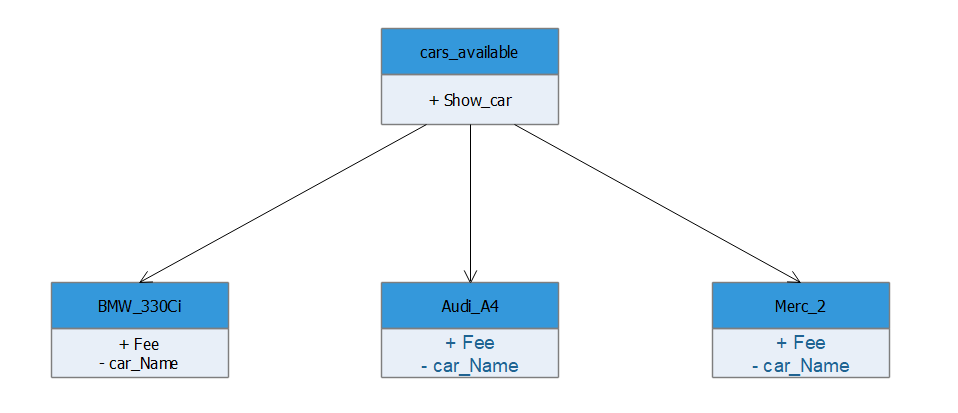

# Abstract Factory 

This design pattern is built on the factory method design pattern. It just adds one more level of encapsulation. Abstract factory aims at providing the user with a way of creating objects of related classes at a given instance without exposing the exact class that is being instantiated, up until runtime. 

Advantages of Abstract Factory method:

    1. Products which we are getting from factory are surely compatible with each other.
    2. It is easy to introduce the new variants of the products without breaking the existing client code.

Dis-advantages of Abstract factory method:

    1. Our simple code may become complicated due to the existence of lot of classes.
    2. We end up with huge number of small files i.e.  cluttering of files
	



# Python example 
We created a unique class named Cars_avaliable which will handle all the object instantiation automatically [abstract_factory_method.py](abstract_factory_method.py) . By any chance if we add a new car to the lot, we don’t need to worry about it.

## Running the example

```
$ python abstract_factory_method.py

Name of car Audi_A4
Its priced at 30 /hour
Name of car Merc_S550
Its priced at 90 /hour
Name of car Merc_S550
Its priced at 90 /hour
Name of car BMW_330Ci
Its priced at 56 /hour
Name of car BMW_330Ci
Its priced at 56 /hour
Name of car BMW_330Ci
Its priced at 56 /hour
Name of car Merc_S550
Its priced at 90 /hour

```
