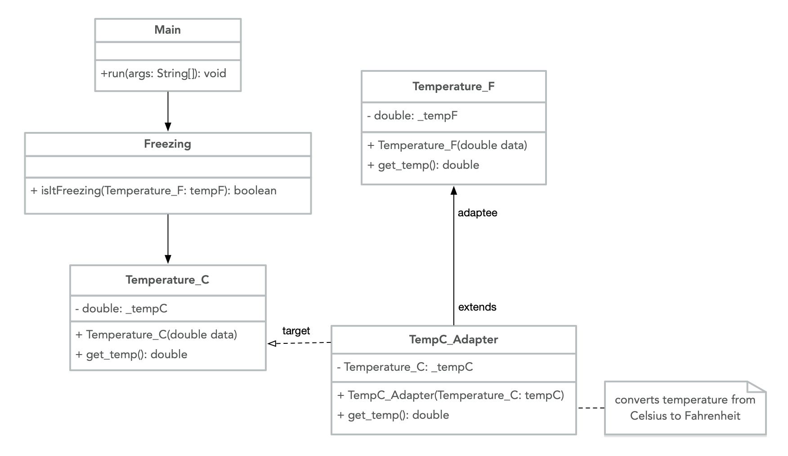

# Adapter

Adapter is a structural design pattern that allows classes to work together when they otherwise couldn't due to incompatible interfaces. It is a useful solution when a client needs a class that is similar to an existing class, but the interface of that class does not match what the client needs -- it enables existing code to be reused. Wrapper is another term used for the Adapter pattern, since the pattern is implemented using a class that provides the necessary modifications to extend the use of another class.

A practical use of the Adapter pattern could be for temperature. If the United States decides to switch its official temperature scale from Fahrenheit to Celsius, existing code based on the Fahrenheit scale could be kept intact by using the Adapter pattern to adapt legacy code to the new standard. Here is a UML illustration of the Adapter Pattern for classes related to Temperature:



## Java example

There are two ways to implement the Adapter design pattern. An Object Adapter uses object composition to implement one object by adapting another one. A Class Adapter uses inheritance to implement multiple interfaces from multiple objects at the same time. Since multiple inheritance can result in problems for the compiler and is not supported by Java (when implemented using classes), this example uses an Object Adapter.

In this case, the `driver` class [driver.java](driver.java) is a Client that wants to know if the temperature is freezing. The existing `Freezing` class [Freezing.java](Freezing.java) was built for the `Temperature_F` class [Temperature_F.java](Temperature_F.java), and its functionality is not compatible with the current Target -- the new official temperature scale, `Temperature_C` class [Temperature_C.java](Temperature_C.java). This issue can be resolved with a `TempC_Adapter` class [TempC_Adapter.java](TempC_Adapter.java), an Adapter that gets the temperature in degrees Celsius and converts it to the equivalent temperature in degrees Fahrenheit. This makes it so [the Client can ask if the temperature in degrees Celsius is freezing](driver.java#L36), because the in-between `TempC_Adapter` can translate the new standard to the [existing degrees Fahrenheit method previously used to determine if it is freezing](Freezing.java#L11).

### Running the Example

To run this example, first compile the source files with `javac` to create executable byte code. Start with `Temperature_F` and `Temperature_C`, as they are independent classes. Then compile `Freezing` and `TempC_Adapter`, as they are dependent on `Temperature_F` and `Temperature_C`, respectively. Finish by compiling `driver.java`, then run the program with `java driver`. The program asks for temperature values, first in degrees Fahrenheit (the class originally compatible with `Freezing`), then in degrees Celsius (which works because the Adapter extends the `Temperature_F` class).

```{bash}
$ javac Temperature_F.java Temperature_C.java
$ javac Freezing.java TempC_Adapter.java
$ javac driver.java
$ java driver
Is it freezing?
Enter the temperature in Fahrenheit:
23.0
Yes, it is freezing   // 23.0F is below freezing (32.0F)

Is it freezing?
Enter the temperature in Celsius:
23.0
No, it is not freezing  // 23.0C is equivalent to 73.4F

```
