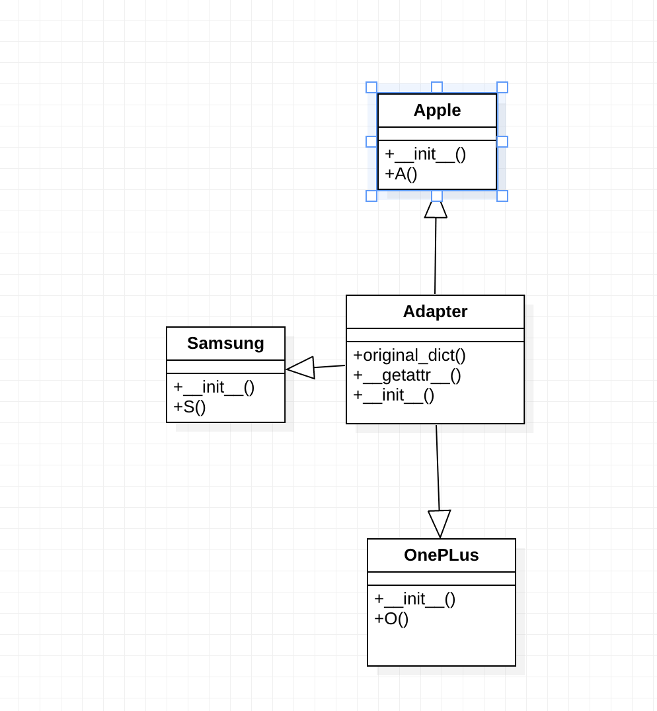

# Adapter

We can use Adapter Method by creating an object adapter-
1.	Client should make a request to the adapter by calling a method on it using the target interface.
2.	Using the Adaptee interface, the Adapter should translate that request on the adaptee.
3.	Result of the call is received the client and he/she is unaware of the presence of the Adapter’s presence.

Advantages:
1. Flexibilty: Adapter Method helps in achieving the flexibility and reusability of the code.
2. Less complicated class: Our client class is not complicated by having to use a different interface and can use polymorphism to swap between different implementations of adapters.




# Python example

In this case, we can create the `Adapter` class ([Adapter.py](Adapter.py)),

1. Client should make a request to the adapter by calling a method on it using the target interface.

2. Result of the call is received the client and he/she is unaware of the presence of the Adapter’s presence.

# Output of the program

```
OnePlus has 2400Mah battery
Apple has 1750Mah battery
Samsung has 2000Mah battery
```